# Membuat CRUD Laravel Sederhana NO CSS menggunakan Laravel dengan Eloquent ORM
## 1. Langkah-Langkah Instalasi
- Install Composer 
- Pastikan PHP versi 8.1 sudah terinstall atau lebih ( Laragon )
- buka terminal dan install laravel ( versi 10)

    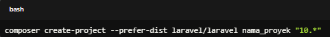

- Gantilah nama_proyek dengan nama yang Anda inginkan untuk aplikasi Laravel Anda.
- Masuk ke Direktori Proyek: Setelah instalasi selesai, masuk ke direktori proyek Anda:
    
    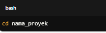
- Jalankan Server Lokal: Anda dapat menjalankan server pengembangan lokal dengan perintah:
    
    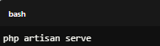
## 2. Persiapan Proyek CRUD
- buatlah proyek Laravel dengan nama crud-app
    
    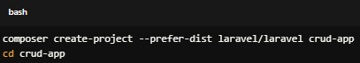
- jalankan server
    
    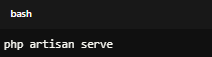
## 3. Buat Database
-   Buat Database: Buat database baru di MySQL, misalnya crud_db.
- Konfigurasi Database: Edit file .env untuk mengatur koneksi database

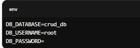
## 4. Buat Model dan Migrasi
- Buat Model dan Migrasi

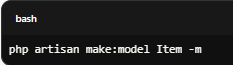
- Edit Migrasi: Buka file migrasi di database/migrations/xxxx_xx_xx_create_items_table.php dan tambahkan kolom:

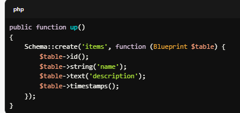
- Jalankan Migrasi

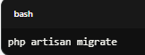
## 5. Buat Controller
- Buat Controller

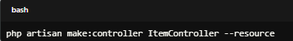
- Implementasikan CRUD di Controller: Buka app/Http/Controllers/ItemController.php dan tambahkan kode berikut:

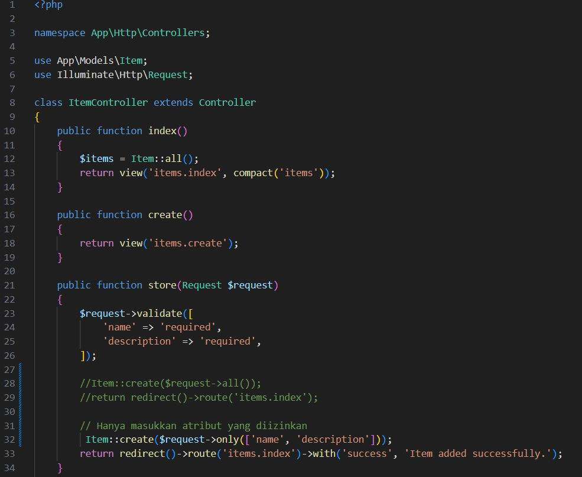
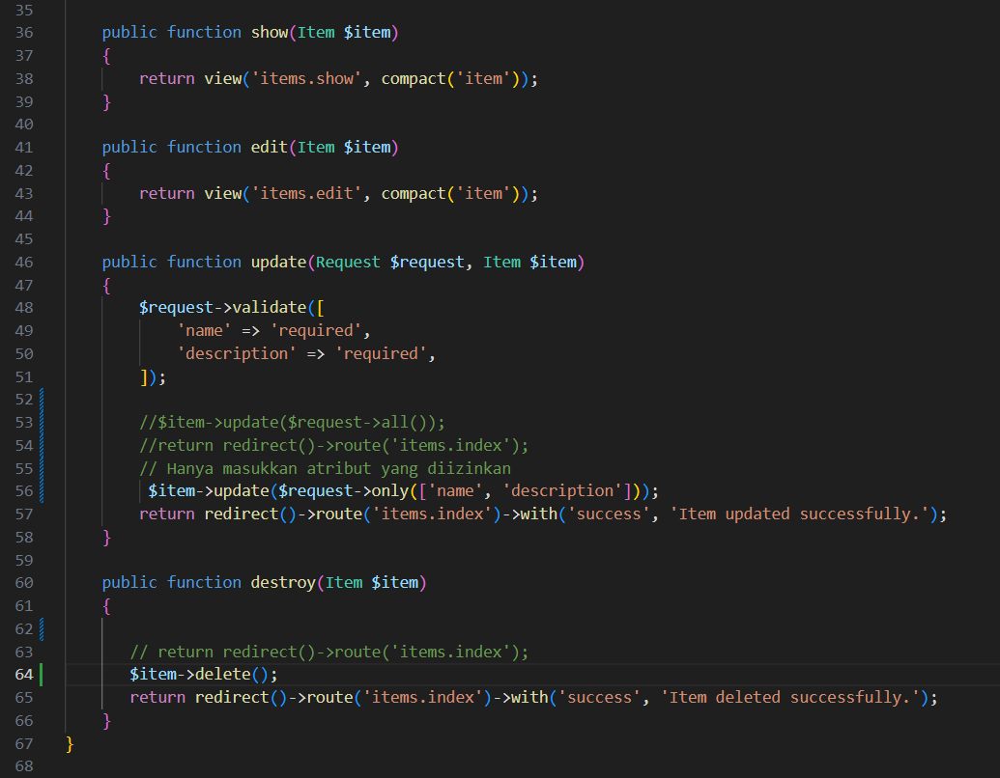

## 6. Buat Routing
-   Edit File Routing: Buka routes/web.php dan tambahkan

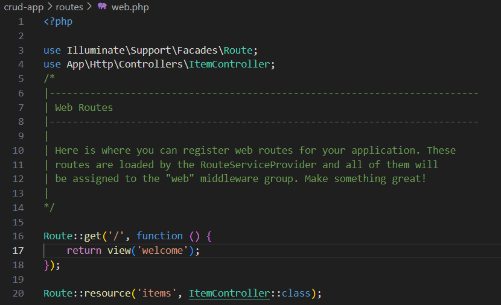

## 7. Buat View
- Buat Folder Views: Buat folder items di resources/views.
-   Buat File View:
     1. index.blade.php

     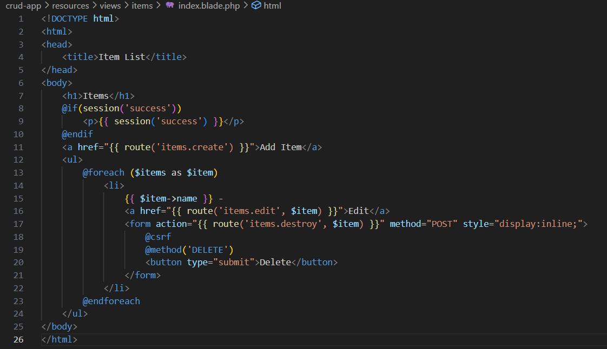

     2. create.blade.php

     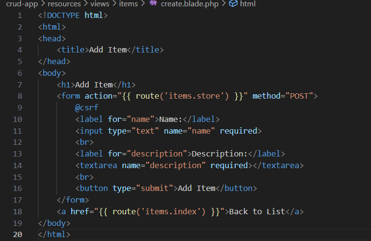

     3. edit.blade.php

     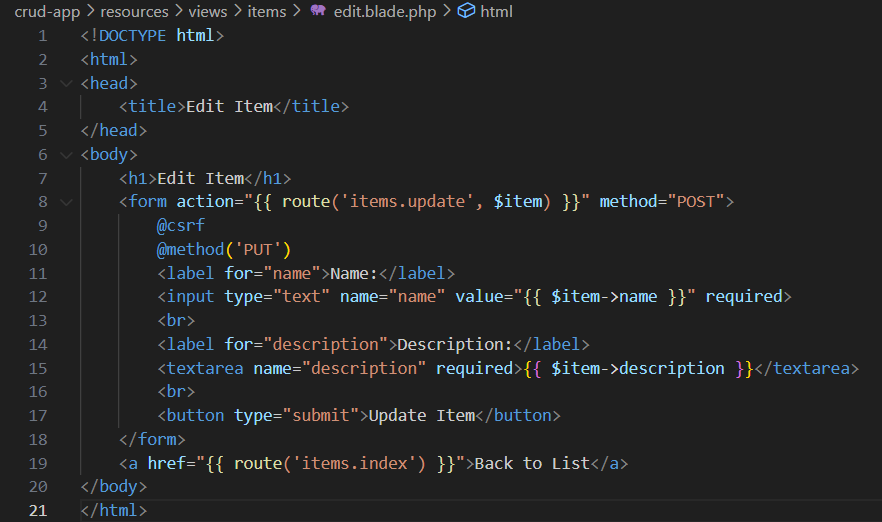
     
     4. show.blade.php

     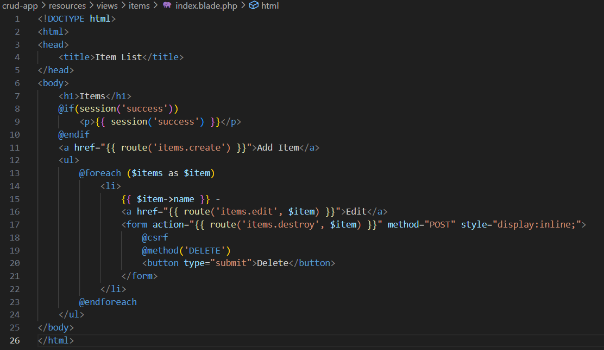

## 8. Done
- Jalankan 

  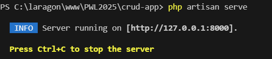

- hasilnya

  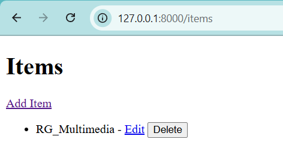

