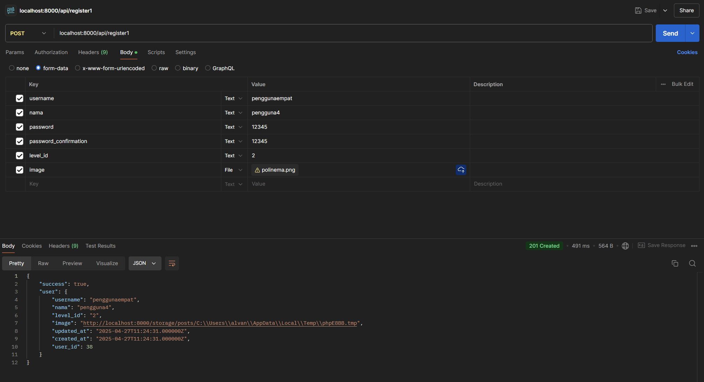
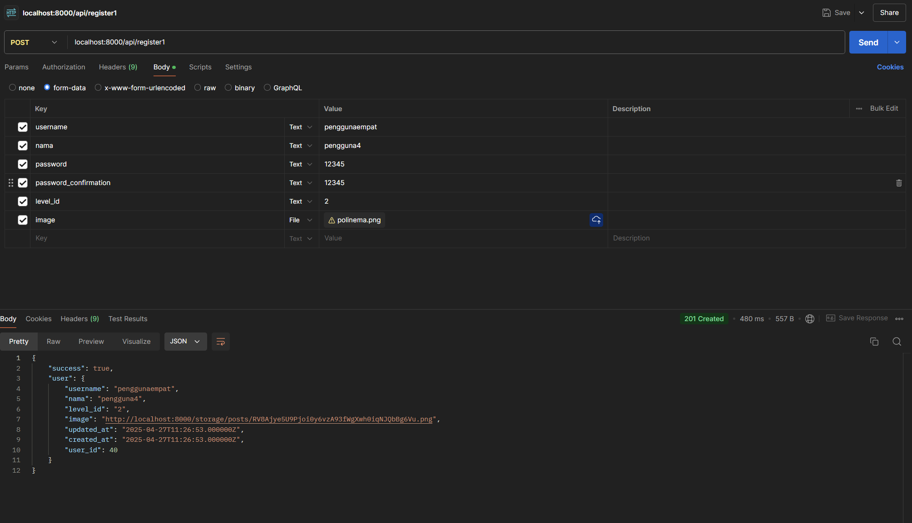
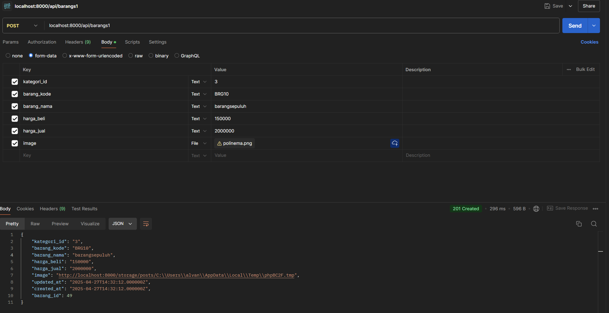
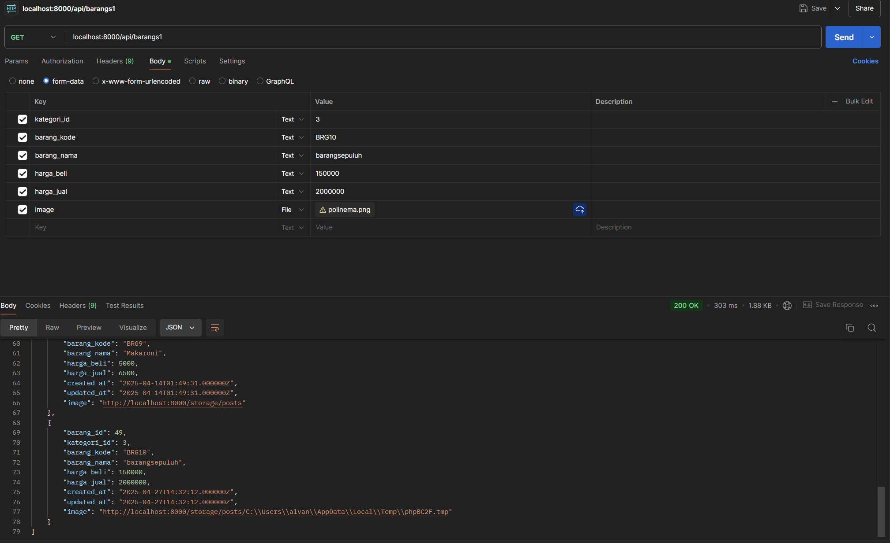

# Laporan Praktikum Jobsheet 11

## Identitas

- **Mata Kuliah**: Pemrograman Web Lanjut  
- **Program Studi**: Teknik Informatika  
- **Semester**: 4  
- **Praktikum**: Jobsheet 11 – RESTFUL API 2
- **Nama**: Alvanza Saputra Yudha  
- **NIM**: 2341720182  
- **Kelas**: TI-2A  

---

## Praktikum 1 -  Implementasi Eloquent Accessor

1. **Membuat migrasi untuk menambahkan image ke tabel m_user**
2. **Memodifikasi `UserModel.php`**
3. **Memodifikasi `Api/RegisterController.php`**
4. **Menambahkan register1 pada `routes/api.php`**
5. **Hasil**

    - Input pengguna4 dengan image

        

    - Input pengguna4 setelah ditambahkan hashName(). perbedaan dengan sebelumnya adalah nama dari file imagenya di hash sehingga yang disimpan bukan nama asli filenya.

        

## Tugas

1. Implementasikan API untuk upload file/gambar pada tabel lainnya yaitu tabel m_barang dan gunakan pada transaksi. Uji coba dengan method GET untuk memanggil data yang sudah diinputkan.

    - Input data pada table m_barang menggunakan image

        

    - Memanggil data yang sudah diinputkan dengan method GET 

        