# Laporan Praktikum Jobsheet 03

## Identitas
- **Mata Kuliah**: Pemrograman Web Lanjut (PWL)
- **Program Studi**: Teknik Informatika
- **Semester**: 4 
- **Praktikum**: Jobsheet 03 – Migration, Seeder, DB Façade, Query Builder, dan Eloquent ORM
- **Nama**: Alvanza Saputra Yudha
- **NIM**: 2341720182
- **Kelas**: TI-2A

---

## A. Pengaturan Database

1. **Membuat Database PWL_POS**
   ```sql
   CREATE DATABASE PWL_POS;
   ```
   

2. **Mengatur Konfigurasi Database di `.env` dan APP_KEY**
   ```plaintext
   DB_DATABASE=PWL_POS
   DB_USERNAME=root
   DB_PASSWORD=
   ```
   

4. **Commit Perubahan ke Git**
   ```bash
   git add .
   git commit -m "Setup database configuration"
   ```

---

## B. Migration

1. **Membuat Migration untuk `m_level`**
   ```bash
   php artisan make:migration create_m_level_table
   ```

2. **Menjalankan Migration**
   ```bash
   php artisan migrate
   ```

3. **Cek Hasil di phpMyAdmin**
   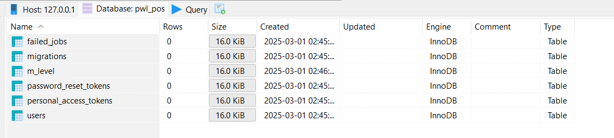

4. **Membuat migrasi tabel m_kategori**
   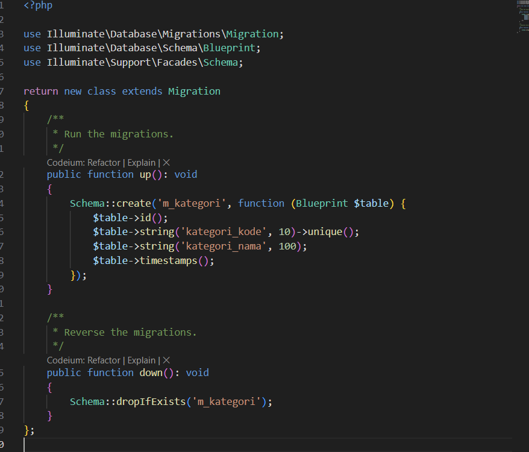

5. **Cek tabel m_kategori di database**
   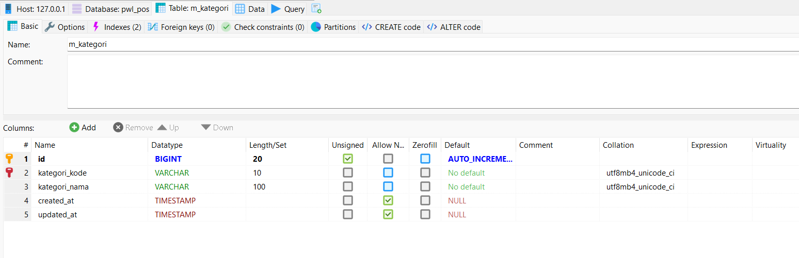

6. **Membuat tabel lainnya dan menghubungkannya**
   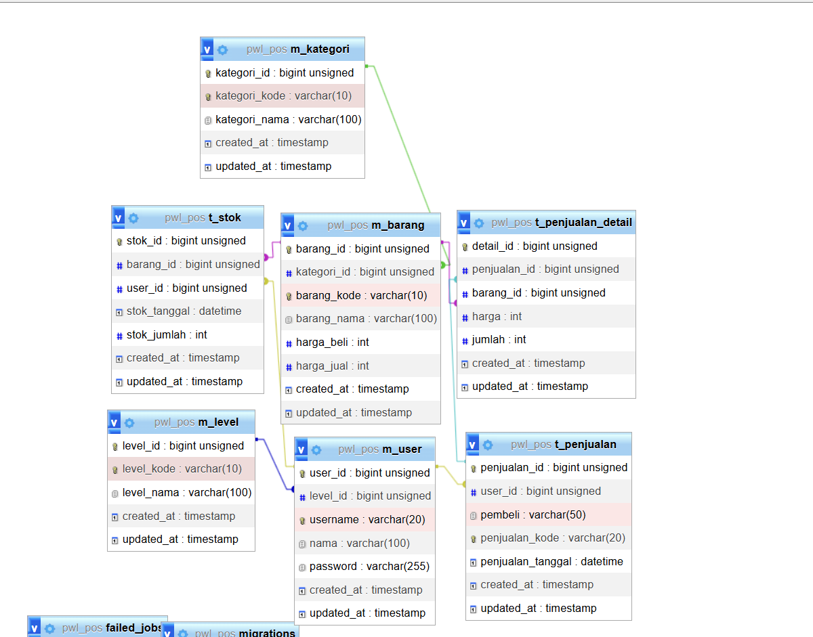

---

## C. Seeder

1. **Membuat Seeder untuk `m_level`**
   ```bash
   php artisan make:seeder LevelSeeder
   ```

2. **Menjalankan Seeder**
   ```bash
   php artisan db:seed --class=LevelSeeder
   ```

3. **Cek hasil seeder tabel m_level**
   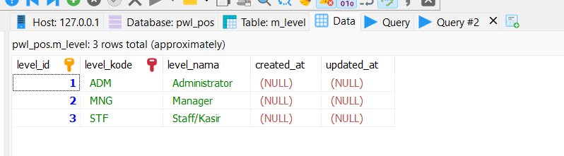

4. **Cek hasil seeder tabel m_user**
   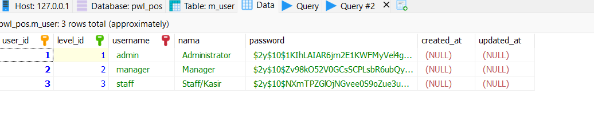

5. **Cek hasil seeder tabel m_kategori**
   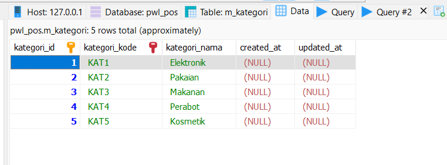

6. **Cek hasil seeder tabel t_stok**
   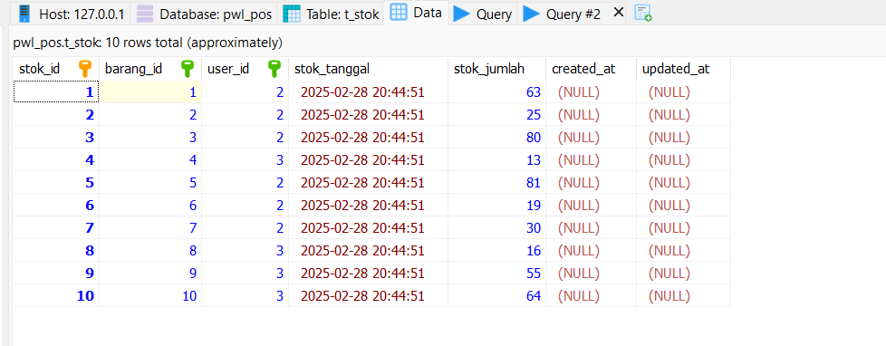

7. **Cek hasil seeder tabel m_barang**
   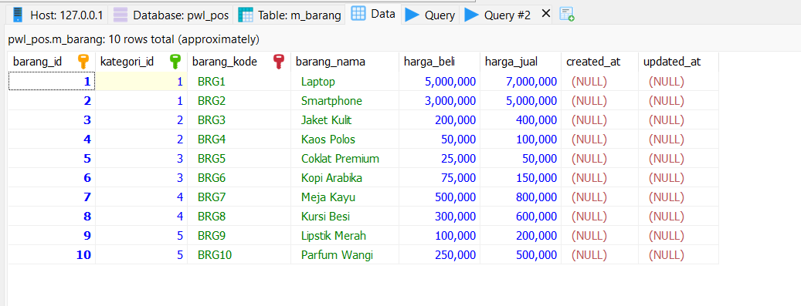

8. **Cek hasil seeder tabel t_penjualan**
   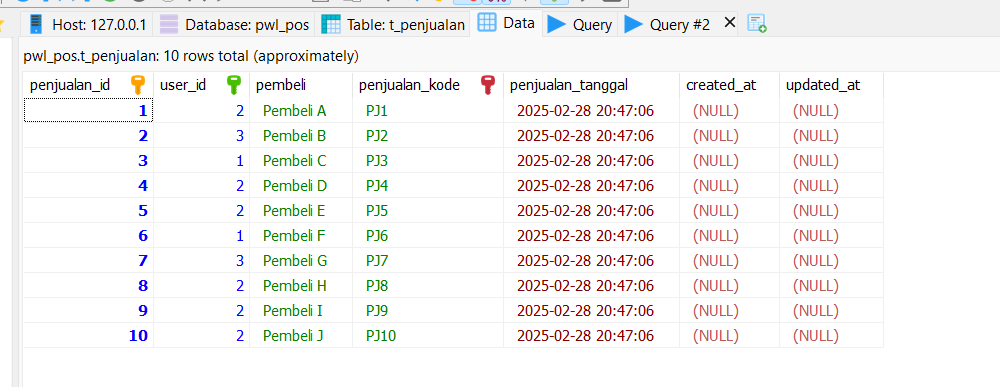

9. **Cek hasil seeder tabel t_penjualan_detail**
   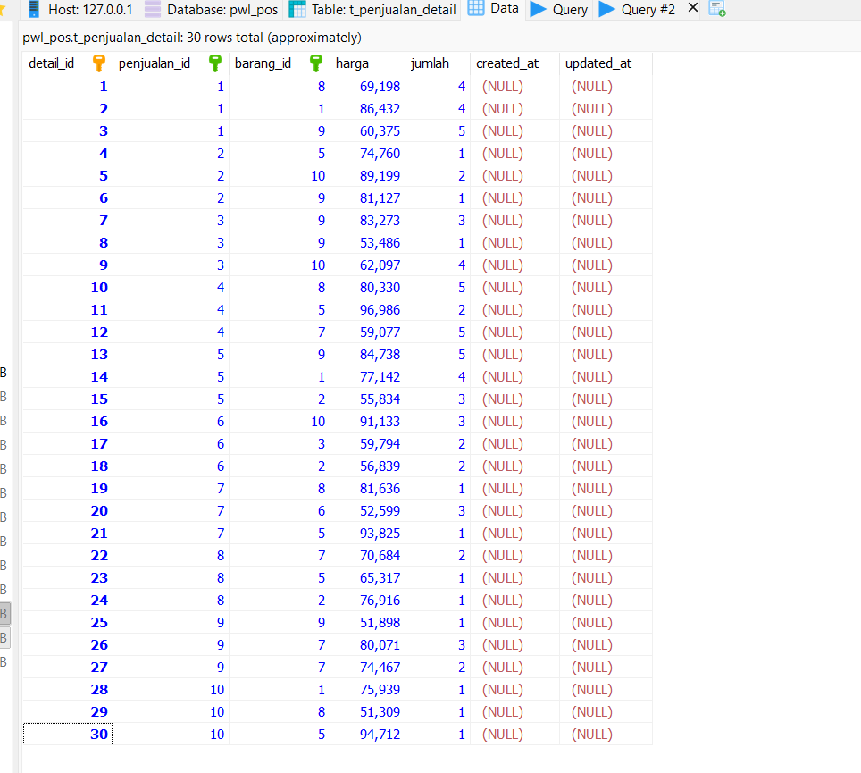
---

## D. DB Facade

1. **Menambahkan Data dengan `DB::insert()`**
   ```php
    DB::insert('insert into m_level(level_kode, level_nama, created_at) values (?, ?, ?)', ['CUS', 'Pelanggan', now()]);
    return 'Insert data baru berhasil';
   ```
   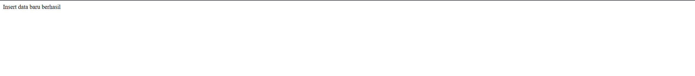
   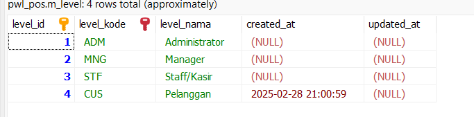

2. **Mengedit Data dengan `DB::update()`**
   ```php
    $row = DB::update('update m_level set level_nama = ? where level_kode = ?', ['Customer', 'CUS']);
    return 'Update data berhasil. Jumlah data yang diupdate ' . $row . " baris";
   ```
   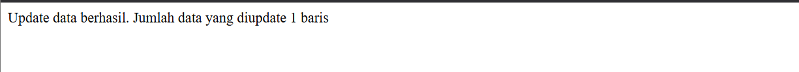
   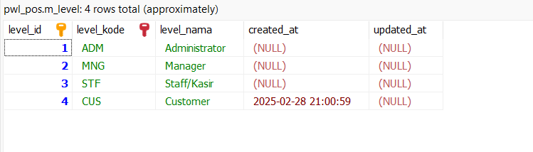

3. **Menghapus Data dengan `DB::delete()`**
   ```php
    $row = DB::delete('delete from m_level where level_kode = ?', ['CUS']);
    return 'Delete data berhasil. Jumlah data yang dihapus ' . $row . " baris";
   ```
   
   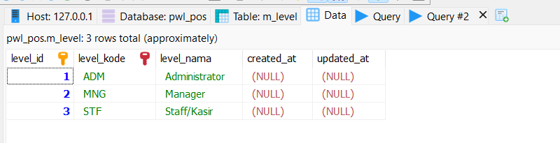

4. **Menampilkan Data dengan `DB::select()`**
   ```php
    $data = DB::select('select * from m_level');
    return view('level', ['data' => $data]);
   ```
   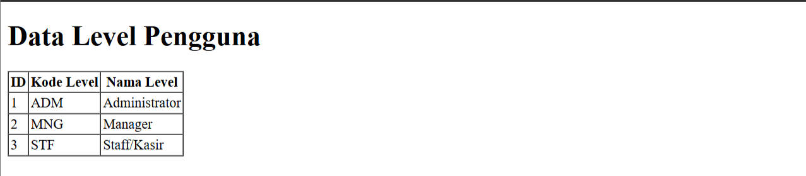

---

## E. Query Builder

1. **Menambahkan Data**
   ```php
    $data = [
        'kategori_kode' => 'SNK',
        'kategori_nama' => 'Snack/Makanan Ringan',
        'created_at' => now()
    ];
    DB::table('m_kategori')->insert($data);
    return 'Insert data baru berhasil';
   ```
   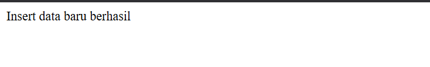

2. **Mengupdate Data**
   ```php
    $row = DB::table('m_kategori')->where('kategori_kode', 'SNK')->update(['kategori_nama' => 'Camilan']);
    return 'Update data berhasil. Jumlah data yang diupdate ' . $row . " baris";
   ```
   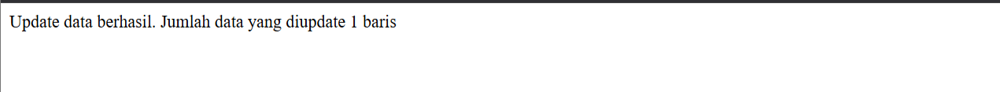

3. **Delete Data**
   ```php
    $row = DB::table('m_kategori')->where('kategori_kode', 'SNK')->delete();
    return 'Delete data berhasil. Jumlah data yang dihapus ' . $row . " baris";
   ```
   

4. **Menampilkan Data**
   ```php
        $data = DB::table('m_kategori')->get();
        return view('kategori', ['data' => $data]);
   ```
   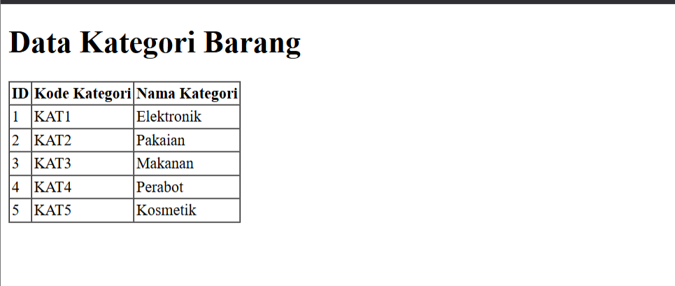

---

## F. Eloquent ORM

1. **Membuat Model untuk `m_user`**
   ```bash
   php artisan make:model UserModel
   ```

2. **Menggunakan Model dalam Controller**
   ```php
   $users = UserModel::all();
   ```

3. **Menampilkan data `m_user`**
    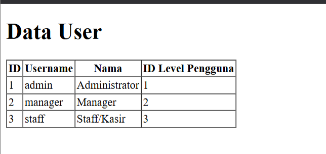

3. **Menambah data `m_user` menggunakan eloquent**
   ```php
    $data = [
        'username' => 'customer-1',
        'nama' => 'Pelanggan',
        'password' => Hash::make('12345'),
        'level_id' => 4
    ];
    UserModel::insert($data);
   ```
    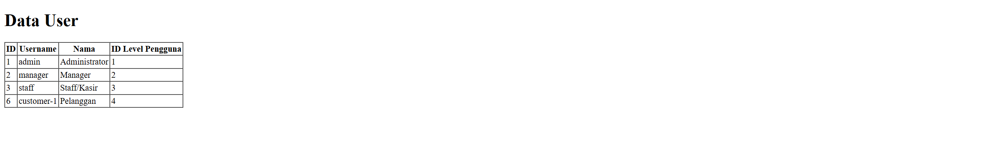

3. **Mengedit data `m_user` menggunakan eloquent**
   ```php
    $data = [
        'nama' => 'Pelanggan Pertama',
    ];
    UserModel::where('username', 'customer-1')->update($data);
   ```
    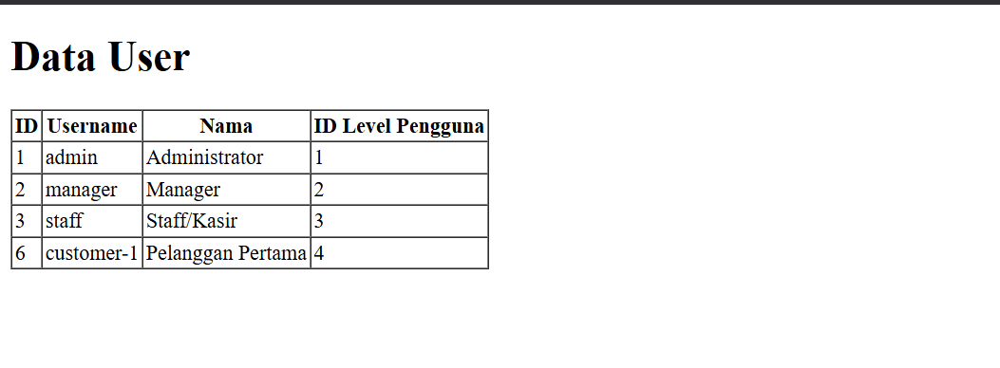

---

## G. Jawaban Pertanyaan

1. **Pada Praktikum 1 - Tahap 5, apakah fungsi dari APP_KEY pada file setting .env Laravel?**
   - APP_KEY digunakan untuk mengenkripsi data dalam Laravel.

2. **Pada Praktikum 1, bagaimana kita men-generate nilai untuk APP_KEY?**
   - Menggunakan perintah `php artisan key:generate`

3. **Pada Praktikum 2.1 - Tahap 1, secara default Laravel memiliki berapa file migrasi? dan untuk apa saja file migrasi tersebut?**
    - Secara default, Laravel memiliki tiga file migrasi utama:
        1. `create_users_table.php`: Digunakan untuk membuat tabel `users`, yang berisi informasi pengguna seperti email, password, dan timestamps.
        2. `create_password_resets_table.php`: Digunakan untuk menyimpan data reset password pengguna, yang berisi email dan token reset.
        3. `create_failed_jobs_table.php`: Digunakan untuk mencatat pekerjaan (jobs) yang gagal dalam sistem queue Laravel.
   
4. **Secara default, file migrasi terdapat kode $table->timestamps();, apa tujuan/output dari fungsi tersebut?**
   - Fungsi ini menambahkan kolom `created_at` dan `updated_at` secara otomatis ke dalam tabel.

5. **Pada File Migrasi, terdapat fungsi $table->id(); Tipe data apa yang dihasilkan dari fungsi tersebut?**
   - Menghasilkan tipe data `BIGINT` dengan auto-increment

6. **. Apa bedanya hasil migrasi pada table m_level, antara menggunakan $table->id(); dengan menggunakan $table->id('level_id'); ?**
   - `$table->id();` membuat kolom dengan nama `id`, sedangkan `$table->id('level_id');` memberi nama kolom primary key sebagai `level_id`.

7. **Pada migration, Fungsi ->unique() digunakan untuk apa?**
   - Untuk memastikan bahwa nilai dalam kolom tersebut tidak ada yang duplikat.

8. **Pada Praktikum 2.2 - Tahap 2, kenapa kolom level_id pada tabel m_user menggunakan $tabel->unsignedBigInteger('level_id'), sedangkan kolom level_id pada tabel m_level menggunakan $tabel->id('level_id') ?**
   - Karena `m_user.level_id` adalah foreign key yang merujuk ke `m_level.level_id`, sehingga harus `unsignedBigInteger` agar sesuai dengan tipe data `BIGINT` yang dihasilkan oleh `$table->id()`.

9. **Pada Praktikum 3 - Tahap 6, apa tujuan dari Class Hash? dan apa maksud dari kode program Hash::make('1234');?**
   - Class `Hash` digunakan untuk hashing password, `Hash::make('1234');` akan mengubah string `1234` menjadi ter-enkripsi.

10. **Pada Praktikum 4 - Tahap 3/5/7, pada query builder terdapat tanda tanya (?), apa kegunaan dari tanda tanya (?) tersebut?**
    - Tanda `?` digunakan sebagai placeholder untuk parameter.
   
11. **Pada Praktikum 6 - Tahap 3, apa tujuan penulisan kode protected $table = ‘m_user’; dan protected $primaryKey = ‘user_id’; ?**
    - `protected $table` menentukan nama tabel yang digunakan model, `protected $primaryKey` menentukan primary key yang digunakan.

12. **Menurut kalian, lebih mudah menggunakan mana dalam melakukan operasi CRUD ke database (DB Façade / Query Builder / Eloquent ORM) ? jelaskan**
    - Menurut saya, Eloquent ORM lebih mudah digunakan karena berbasis model dan object-oriented, sehingga lebih rapi dan mudah dipahami dibandingkan DB Façade dan Query Builder.

---