# Laporan Praktikum Jobsheet 04

## Identitas
- **Mata Kuliah**: Pemrograman Web Lanjut 
- **Program Studi**: Teknik Informatika
- **Semester**: 4 
- **Praktikum**: Jobsheet 04 – Model dan Eloquent ORM
- **Nama**: Alvanza Saputra Yudha
- **NIM**: 2341720182
- **Kelas**: TI-2A

---

## A. Properti $fillable dan $guarded

### Praktikum 1 - $fillable

1. **Menambahkan $fillable pada model UserModel.php**
   ```php
   protected $fillable = ['username', 'nama', 'password', 'level_id'];
   ```

2. **Mengubah UserController.php untuk menambahkan data baru**
   ```php
   $data = [
       'username' => 'customer-1',
       'nama' => 'Pelanggan',
       'password' => Hash::make('12345'),
       'level_id' => 4
   ];
   UserModel::create($data);
   ```

3. **Hasil dari penggunaan fillable pada model**

   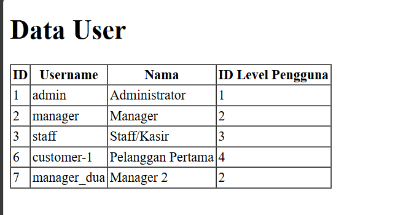

   Data pada tabel user bertambah

4. **Mengubah $fillable dan menjalankan kembali**
   ```php
   protected $fillable = ['username', 'nama', 'level_id'];
   ```

5. **Hasil dari perubahan $fillable**
   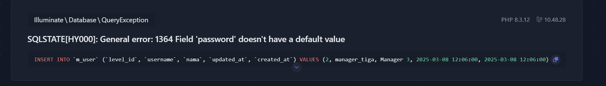
   Terjadi error karena password tidak dituliskan dalam fillable

---

## B. Retrieving Single Models

### Praktikum 2.1 - Retrieving Single Models

1. **Mengubah UserController.php untuk mengambil single model dengan find**
   ```php
   $user = UserModel::find(1);
   ```

2. **Mengubah user.blade.php untuk menampilkan single model**
   ```php
   <p>{{ $user->username }} - {{ $user->nama }}</p>
   ```

3. **Hasil dari penggunaan find**

   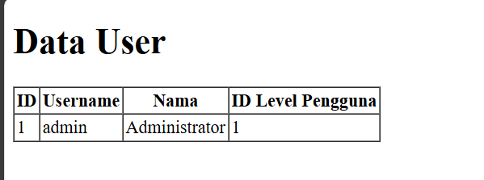

   Program hanya menampilkan 1 data dengan id 1 karena kita mengisi fungsi find dengan angka 1

4. **Menggunakan method first() pada UserController.php**
   ```php
   $user = UserModel::where('level_id', 1)->first();
   ```

5. **Hasil penggunaan method first()**

   

   Program menampilkan data dengan user_id 1 menggunakan fungsi where

6. **Menggunakan method firstWhere()**
   ```php
   $user = UserModel::firstWhere('level_id', 2);
   ```

7. **Hasil penggunaan method firstWhere()**

    

    Program menampilkan data dengan user_id 1 menggunakan fungsi firstWhere

8. **Implementasi metode findOr**
   ```php
   $user = UserModel::findOr(1, ['username', 'nama'], function () {
       abort(404);
   });
   ```

9. **Hasil penggunaan findOr**

   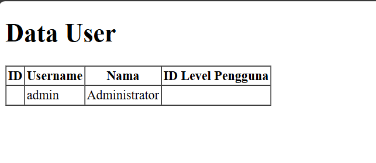

   Program hanya menampilkan username dan nama dari user_id 1

9. **Hasil penggunaan findOr untuk data yang tidak ditemukan**

   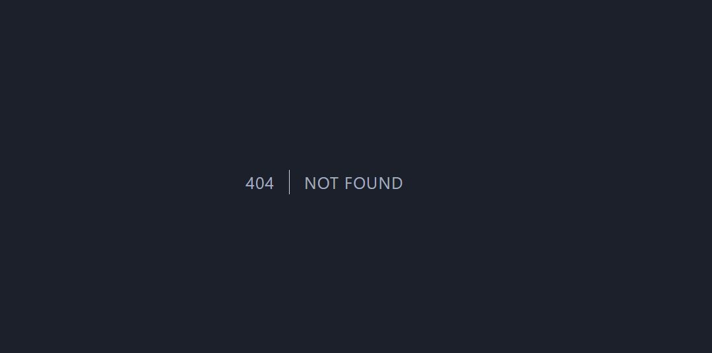

   Hasilnya error 404 karena program tidak menemukan data dengan id 20

### Praktikum 2.2 - Not Found Exceptions

1. **Implementasi metode findOrFail**
   ```php
   $user = UserModel::findOrFail(1);
   ```

2. **Hasil penggunaan firstOrFail**

   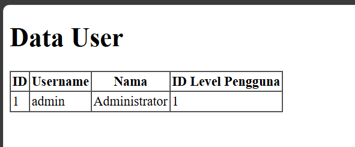

3. **Implementasi metode firstOrFail untuk data yang tidak ada**
   ```php
   $user = UserModel::where('username', 'manager-9')->firstOrFail();
   ```

4. **Hasil error dari firstOrFail**

   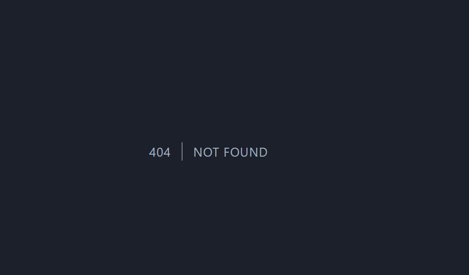

### Praktikum 2.3 - Retreiving Aggregrates

1. **Menggunakan metode count() pada Model**
   ```php
    $user = UserModel::where('level_id', 2)->count();
    dd($user);
   ```

2. **Hasil penggunaan metode count()**

   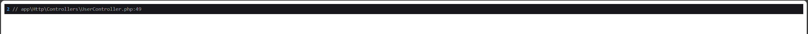

3. **Menampilkan jumlah user pada halaman browser**
   ```php
    <tr>
        <th>Jumlah Pengguna</th>
    </tr>
    <tr>
        <td>{{ $data }}</td>
    </tr>
   ```

   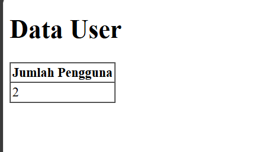

### Praktikum 2.4 - Retreiving or Creating Models

1. **Implementasi metode firstOrCreate**
   ```php
    $user = UserModel::firstOrCreate(
        [
            'username' => 'manager',
            'nama' => 'Manager',
        ]
    );
   ```

2. **Hasil penggunaan firstOrCreate**

   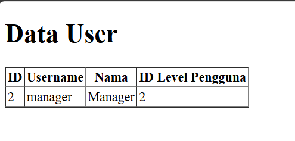

4. **Implementasi metode firstOrCreate untuk data yang belum ada**
   ```php
    $user = UserModel::firstOrCreate(
        [
            'username' => 'manager22',
            'nama' => 'Manager Dua Dua',
            'password' => Hash::make('12345'),
            'level_id' => 2
        ]
    );
   ```

5. **Hasil firstOrCreate untuk data yang belum ada**

   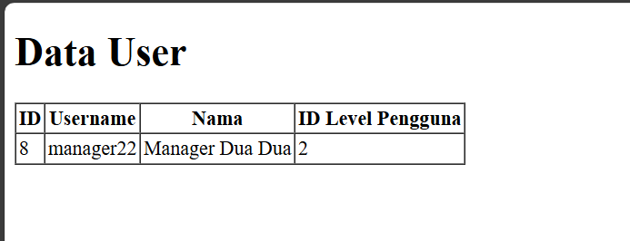

   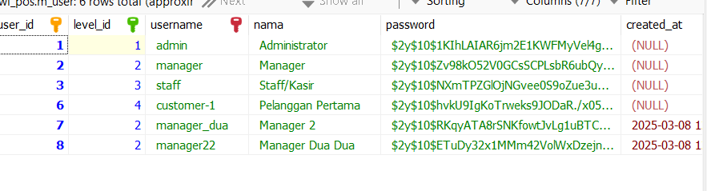

6. **Implementasi metode firstOrNew**
   ```php
    $user = UserModel::firstOrNew(
        [
            'username' => 'manager',
            'nama' => 'Manager',
        ]
    );
   ```

7. **Hasil penggunaan firstOrNew**

   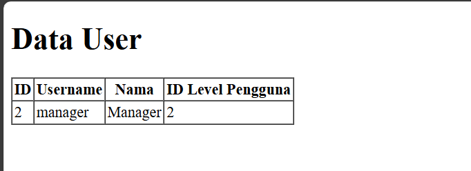

8. **Implementasi metode firstOrNew**
   ```php
    $user = UserModel::firstOrNew(
        [
            'username' => 'manager33',
            'nama' => 'Manager Tiga Tiga',
            'password' => Hash::make('12345'),
            'level_id' => 2
        ]
    );
   ```

9. **Hasil data di database setelah firstOrNew**

   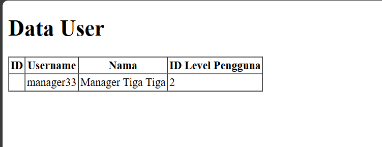

   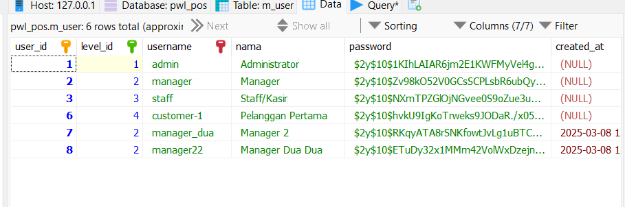

10. **Implementasi metode firstOrNew dengan save()**
   ```php
    $user = UserModel::firstOrNew(
        [
            'username' => 'manager33',
            'nama' => 'Manager Tiga Tiga',
            'password' => Hash::make('12345'),
            'level_id' => 2
        ]
    );
    $user->save();
   ```

11. **Hasil data di database setelah firstOrNew dengan save()**

   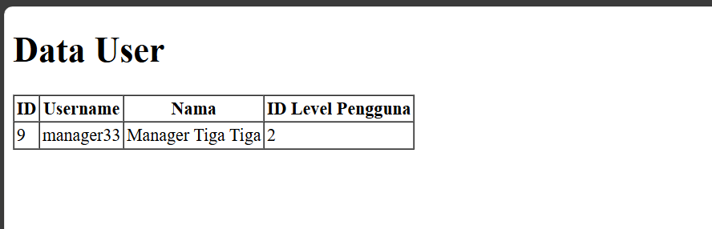

   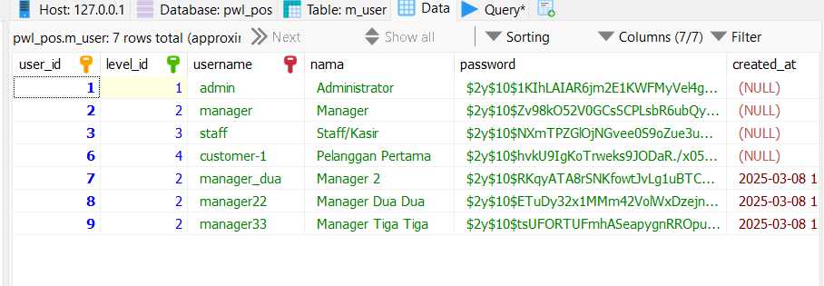

### Praktikum 2.5 - Attribute Changes

1. **Implementasi metode isDirty dan isClean**
   ```php
    $user = UserModel::create([
        'username' => 'manager55',
        'nama' => 'Manager55',
        'password' => Hash::make('12345'),
        'level_id' => 2
    ]);
    
    $user->username = 'manager56';
    
    $user->isDirty();
    $user->isDirty('username');
    $user->isDirty('nama');
    $user->isDirty(['nama', 'username']);
    
    $user->isClean();
    $user->isClean('username');
    $user->isClean('nama');
    $user->isClean(['nama', 'username']);
    
    $user->save();
    
    $user->isDirty();
    $user->isClean();
    dd($user->isDirty());
   ```

2. **Hasil penggunaan isDirty dan isClean**

   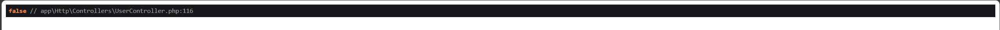

3. **Implementasi metode wasChanged**
   ```php
    $user = UserModel::create([
        'username' => 'manager11',
        'nama' => 'Manager11',
        'password' => Hash::make('12345'),
        'level_id' => 2
    ]);
    
    $user->username = 'manager12';

    $user->save();

    $user->wasChanged();
    $user->wasChanged('username');
    $user->wasChanged(['username', 'level_id']);
    $user->wasChanged('nama');
    dd($user->wasChanged(['nama', 'username']));
   ```

4. **Hasil penggunaan wasChanged**

   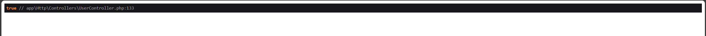

### Praktikum 2.6 - Create, Read, Update, Delete (CRUD)

1. **Membuat tampilan untuk Read pada user.blade.php**
   ```php
   <table class="table">
       <thead>
           <tr>
               <th>ID</th>
               <th>Username</th>
               <th>Nama</th>
               <th>Level</th>
               <th>Aksi</th>
           </tr>
       </thead>
       <tbody>
           @foreach($data as $d)
           <tr>
               <td>{{ $d->user_id }}</td>
               <td>{{ $d->username }}</td>
               <td>{{ $d->nama }}</td>
               <td>{{ $d->level_id }}</td>
               <td>
                   <a href="{{ url('/user/ubah', $d->user_id) }}" class="btn btn-warning">Ubah</a>
                   <a href="{{ url('/user/hapus', $d->user_id) }}" class="btn btn-danger">Hapus</a>
               </td>
           </tr>
           @endforeach
       </tbody>
   </table>
   ```

2. **Update controller untuk Read**
   ```php
   public function index()
   {
       $data = UserModel::all();
       return view('user', ['data' => $data]);
   }
   ```

3. **Hasil tampilan Read**

   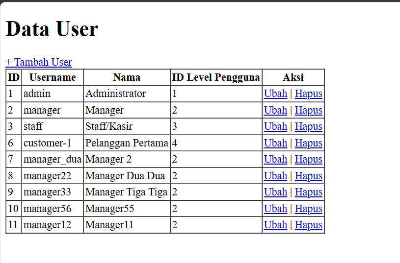

4. **Membuat form untuk Create pada user_tambah.blade.php**
   ```php
    <form method="post" action="{{ url('/user/tambah_simpan') }}">

        {{ csrf_field() }}

        @csrf
        <label>Username</label>
        <input type="text" name="username" placeholder="Masukkan Username">
        <br>
        <label>Nama</label>
        <input type="text" name="nama" placeholder="Masukkan Nama">
        <br>
        <label>Password</label>
        <input type="password" name="password" placeholder="Masukkan Password">
        <br>
        <label>Level ID</label>
        <input type="number" name="level_id" placeholder="Masukkan ID Level">
        <br><br>
        <button type="submit" class="btn btn-primary">Simpan</button>
    </form>
   ```

5. **Menambahkan route untuk halaman tambah**
   ```php
   Route::get('/user/tambah', [UserController::class, 'tambah']);
   ```

6. **Menambahkan method tambah pada UserController**
   ```php
   public function tambah()
   {
       return view('user_tambah');
   }
   ```

7. **Hasil tampilan form Create**

   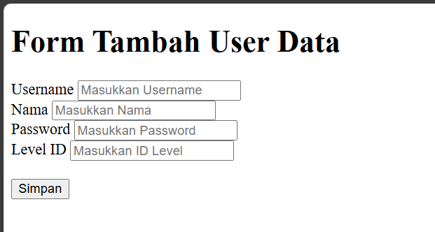

8. **Menambahkan route untuk proses penyimpanan data**
   ```php
   Route::post('/user/tambah_simpan', [UserController::class, 'tambah_simpan']);
   ```

9. **Menambahkan method tambah_simpan pada UserController**
   ```php
   public function tambah_simpan(Request $request)
   {
       UserModel::create([
           'username' => $request->username,
           'nama' => $request->nama,
           'password' => Hash::make($request->password),
           'level_id' => $request->level_id
       ]);
       return redirect('/user');
   }
   ```

10. **Hasil setelah Create data user baru**

    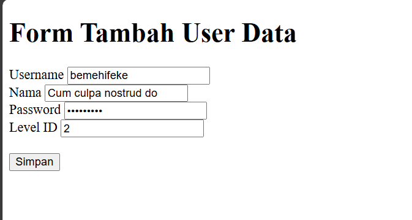

    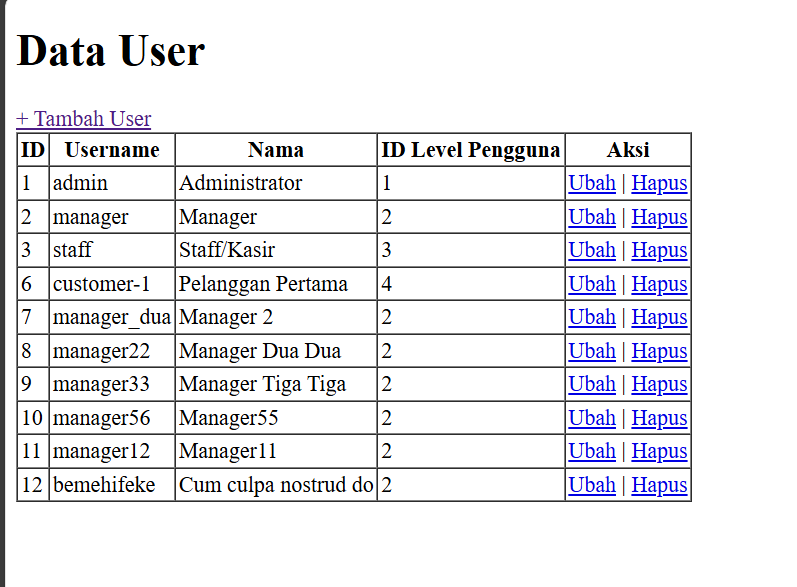

11. **Membuat form untuk Update pada user_ubah.blade.php**
    ```php
    <form method="post" action="/user/ubah_simpan/{{ $data->user_id }}">

        {{ csrf_field() }}
        {{ method_field('PUT') }}

        @csrf
        <label>Username</label>
        <input type="text" name="username" placeholder="Masukkan Username" value="{{ $data->username }}">
        <br>
        <label>Nama</label>
        <input type="text" name="nama" placeholder="Masukkan Nama" value="{{ $data->nama }}">
        <br>
        <label>Password</label>
        <input type="password" name="password" placeholder="Masukkan Password" value="{{ $data->password }}">
        <br>
        <label>Level ID</label>
        <input type="number" name="level_id" placeholder="Masukkan ID Level" value="{{ $data->level_id }}">
        <br><br>
        <button type="submit" class="btn btn-success">Ubah</button>
    </form>
    ```

12. **Menambahkan route untuk halaman ubah**
    ```php
    Route::get('/user/ubah/{id}', [UserController::class, 'ubah']);
    ```

13. **Menambahkan method ubah pada UserController**
    ```php
    public function ubah($id)
    {
        $user = UserModel::find($id);
        return view('user_ubah', ['data' => $user]);
    }
    ```

14. **Hasil tampilan form Update**

    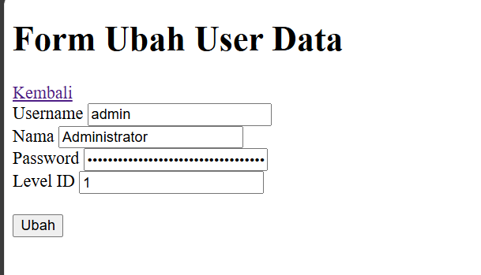

15. **Menambahkan route untuk proses update data**
    ```php
    Route::put('/user/ubah_simpan/{id}', [UserController::class, 'ubah_simpan']);
    ```

16. **Menambahkan method ubah_simpan pada UserController**
    ```php
    public function ubah_simpan(Request $request, $id)
    {
        $user = UserModel::find($id);

        $user->username = $request->username;
        $user->nama = $request->nama;
        $user->password = Hash::make('$request->password');
        $user->level_id = $request->level_id;

        $user->save();

        return redirect('/user');
    }
    ```

17. **Hasil setelah Update data user dengan id 12**

    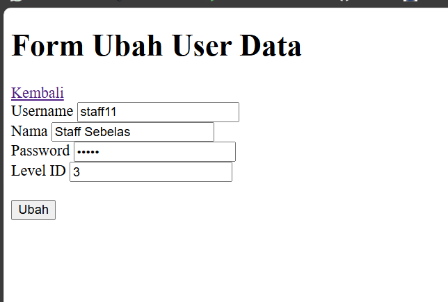

    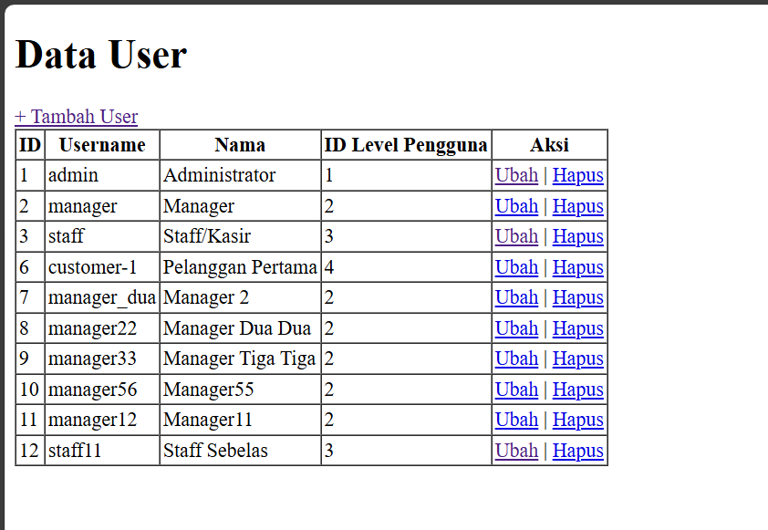

18. **Menambahkan route untuk Delete**
    ```php
    Route::get('/user/hapus/{id}', [UserController::class, 'hapus']);
    ```

19. **Menambahkan method hapus pada UserController**
    ```php
    public function hapus($id)
    {
        $user = UserModel::find($id);
        $user->delete();

        return redirect('/user');
    }
    ```

20. **Hasil setelah Delete data user dengan id 12**
    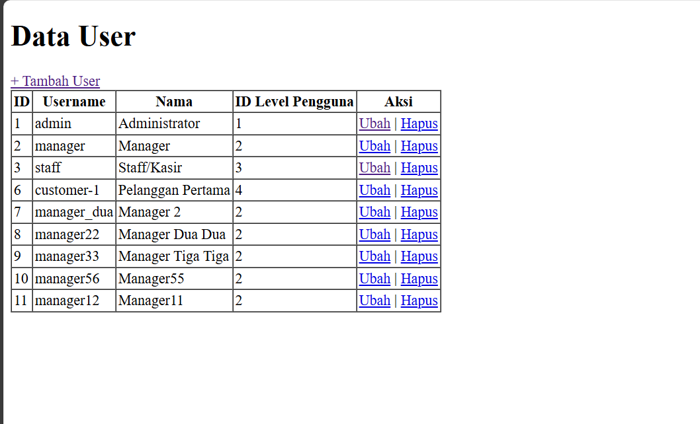

### Praktikum 2.7 - Relationships

1. **Menambahkan relasi pada model UserModel.php**
   ```php
   public function level()
   {
       return $this->belongsTo(LevelModel::class, 'level_id', 'level_id');
   }
   ```
   

2. **Mengubah UserController.php untuk menggunakan relasi level**
   ```php
   public function index()
   {
       $data = UserModel::with('level')->get();
       return view('user', ['data' => $data]);
   }
   ```
   

3. **Hasil dari penggunaan relasi level**
   

4. **Mengubah tampilan user untuk menampilkan level**
   ```php
   <td>{{ $d->level->level_nama }}</td>
   ```
   

5. **Hasil tampilan dengan relasi level**
   

---

## C. Jawaban Pertanyaan

1. **Pada Praktikum 1, apa perbedaan antara $fillable dan $guarded pada model Laravel?**
   - $fillable adalah daftar atribut yang diizinkan untuk assignment massal (mass assignment), sedangkan $guarded adalah daftar atribut yang tidak diizinkan untuk assignment massal. Keduanya berfungsi untuk keamanan mass assignment, tetapi cara kerjanya berkebalikan.

2. **Apa kegunaan dari property $table pada model di Laravel?**
   - Property $table digunakan untuk menentukan nama tabel dalam database yang terkait dengan model. Jika tidak ditentukan, Laravel akan menggunakan bentuk jamak snake_case dari nama model.

3. **Pada Praktikum 2.1, apa perbedaan antara method find() dan first() pada model Eloquent Laravel?**
   - Method find() digunakan untuk mencari record berdasarkan primary key, sedangkan first() digunakan untuk mengambil record pertama yang sesuai dengan query.

4. **Pada Praktikum 2.2, jelaskan perbedaan antara findOrFail() dan firstOrFail() pada Laravel?**
   - Keduanya akan melempar ModelNotFoundException jika data tidak ditemukan. findOrFail() mencari berdasarkan primary key, sedangkan firstOrFail() mengambil record pertama yang sesuai dengan query.

5. **Pada Praktikum 2.4, apa perbedaan antara firstOrCreate() dan firstOrNew()?**
   - firstOrCreate() akan mencari record atau membuat dan menyimpannya ke database jika tidak ditemukan, sedangkan firstOrNew() mencari record atau membuat instance model baru tanpa menyimpannya ke database (perlu memanggil save() secara manual).

6. **Pada Praktikum 2.5, jelaskan perbedaan metode isDirty(), isClean(), dan wasChanged() dalam model Eloquent?**
   - isDirty(): Memeriksa apakah atribut model telah diubah sejak model diambil
   - isClean(): Kebalikan dari isDirty(), memeriksa apakah atribut model tidak berubah sejak diambil
   - wasChanged(): Memeriksa apakah atribut model berubah saat terakhir kali model disimpan

7. **Pada Praktikum 2.7, jelaskan mengapa kita perlu mendefinisikan relasi belongsTo() untuk mengakses model induk?**
   - Relasi belongsTo() diperlukan untuk mendefinisikan hubungan invers dari hasOne() atau hasMany(), yang memungkinkan model anak untuk mengakses model induk melalui foreign key.

8. **Apa perbedaan utama antara metode hasOne() dan hasMany() dalam mendefinisikan relasi di Laravel?**
   - hasOne() mendefinisikan relasi satu-ke-satu di mana model memiliki tepat satu model terkait, sedangkan hasMany() mendefinisikan relasi satu-ke-banyak di mana model memiliki banyak model terkait.

9. **Bagaimana cara mengakses data relasi (eager loading) agar menghindari masalah N+1 query di Laravel?**
   - Menggunakan metode with() untuk melakukan eager loading relasi, contoh: UserModel::with('level')->get()

10. **Apa keuntungan menggunakan Eloquent ORM dibandingkan dengan Query Builder atau DB Facade?**
    - Eloquent ORM mempermudah pengelolaan relasi antar tabel, memiliki banyak fitur yang lebih OOP, menyediakan event dan observer, serta lebih ekspresif dan mudah dibaca.

---