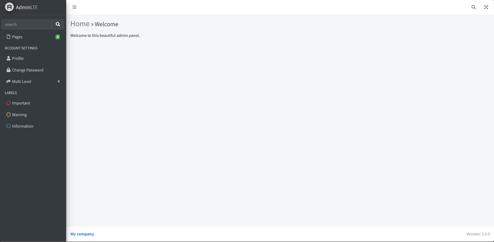
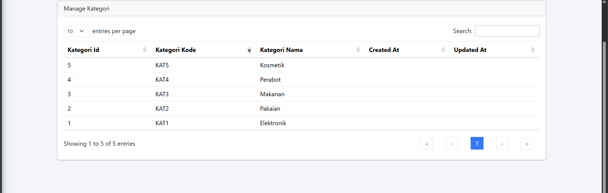

# Laporan Praktikum Jobsheet 05

## Identitas

- **Mata Kuliah**: Pemrograman Web Lanjut
- **Program Studi**: Teknik Informatika
- **Semester**: 4
- **Praktikum**: Jobsheet 05 – Blade View, Web Templating (AdminLTE), DataTables
- **Nama**: Alvanza Saputra Yudha
- **NIM**: 2341720182
- **Kelas**: TI-2A

---

## Praktikum 1 - Integrasi AdminLTE

### Langkah-langkah:
1. **Menginstal AdminLTE**
   - Jalankan perintah berikut untuk menginstal AdminLTE:
    ```bash
    composer require jeroennoten/laravel-adminlte

    php artisan adminlte:install
    ```

2. **Mengonfigurasi Layout AdminLTE**
   - Buat file layout di `resources/views/layouts/app.blade.php`:
    ```php
    @extends('adminlte::page')
    @section('title', 'Dashboard')
    @section('content')
        <h1>Selamat datang di Dashboard</h1>
    @endsection
    ```

2. **Mengonfigurasi halaman welcome**
   - Buat file layout di `resources/views/welcome.blade.php`:
    ```php
    @extends('layout.app')

    {{-- Customize layout sections --}}
    @section('subtitle', 'Welcome')
    @section('content_header_title', 'Home')
    @section('content_header_subtitle', 'Welcome')

    {{-- Content body: main page content --}}
    @section('content_body')
        <p>Welcome to this beautiful admin panel.</p>
    @stop

    {{-- Push extra CSS --}}
    @push('css')
        {{-- Add here extra stylesheets --}}
        {{-- <link rel="stylesheet" href="/css/admin_custom.css"> --}}
    @endpush

    {{-- Push extra scripts --}}
    @push('js')
        <script> console.log("Hi, I'm using the Laravel-AdminLTE package!"); </script>
    @endpush
    ```
    - Hasil

    


---

## Praktikum 2 - Integrasi DataTables

### Langkah-langkah:
1. **Menginstal Yajra DataTables**
   - Jalankan perintah berikut:
    ```bash
    composer require laravel/ui --dev

    composer require yajra/laravel-datatables:^10.0

    npm i laravel-datatables-vite --save-dev

    npm install -D sass
    ```

2. **Membuat KategoriDatable**
    ```php
    public function getColumns(): array
    {
        return [
            Column::make('kategori_id')->addClass('text-start'),
            Column::make('kategori_kode'),
            Column::make('kategori_nama'),
            Column::make('created_at'),
            Column::make('updated_at'),
        ];
    }
    ```

3. **Update Model Kategori**
    ```php
    class KategoriModel extends Model
    {
        use HasFactory;

        protected $table = 'm_kategori';
        protected $primaryKey = 'kategori_id';

        protected $fillable = ['kategori_kode', 'kategori_nama'];
        

        public function barang(): HasMany
        {
            return $this->hasMany(BarangModel::class, 'barang_id', 'barang_id');
        }
    }
    ```

4. **Ubah Controller Kategori**
    ```php
    public function index(KategoriDataTable $dataTable)
    {
        return $dataTable->render('kategori.index');
    }
    ```

5. **Membuat Tabel Data dengan DataTables**
   - Buat view di `resources/views/kategori/index.blade.php`:
    ```php
    @extends('layout.app')

        {{-- Customize layout sections --}}

        @section('subtitle', 'Kategori')
        @section('content_header_title', 'Home')
        @section('content_header_subtitle', 'Kategori')

        @section('content')
            <div class="container">
                <div class="card">
                    <div class="card-header">Manage Kategori</div>
                    <div class="card-body">
                        {{ $dataTable->table() }}
                    </div>
                </div>
            </div>
        @endsection

        @push('scripts')
            {{ $dataTable->scripts() }}
        @endpush

    @endsection
    ```

   - Tambahkan route di `routes/web.php`:
    ```php
    Route::get('/kategori/data', [KategoriController::class, 'data'])->name('kategori.data');
    ```

   - Hasil 

   

---

## Tugas Praktikum

1. Buat fitur **Tambah Kategori** dengan tombol **Add** pada halaman **Manage Kategori**.
2. Tambahkan **Menu Kategori** pada navbar agar mudah diakses.
3. Buat fitur **Edit** dan **Delete** dengan menggunakan DataTables.
4. Pastikan seluruh fitur CRUD berfungsi dengan baik.

---


