# Laporan Praktikum Jobsheet 06

## Identitas

- **Mata Kuliah**: Pemrograman Web Lanjut  
- **Program Studi**: Teknik Informatika  
- **Semester**: 4  
- **Praktikum**: Jobsheet 06 – Ajax Form (AdminLTE) dan Client Validation  
- **Nama**: Alvanza Saputra Yudha  
- **NIM**: 2341720182  
- **Kelas**: TI-2A  

---

## Praktikum 1 - Modal Ajax Tambah Data (Data User)

### Langkah-langkah:
1. **Menambahkan Library jQuery Validation dan SweetAlert**  
   - Tambahkan link library jQuery Validation dan SweetAlert ke `template.blade.php`.

2. **Modifikasi View `user/index.blade.php`**  
   - Tambahkan tombol untuk menampilkan form modal tambah data user dengan AJAX:
     ```html
     <button onclick="modalAction('{{ url('/user/create_ajax') }}')" class="btn btn-sm btn-success mt-1">Tambah Ajax</button>
     ```

3. **Menambahkan Modal pada View `user/index.blade.php`**  
   ```html
   <div id="myModal" class="modal fade animate shake" tabindex="-1" role="dialog" data-backdrop="static" data-keyboard="false" data-width="75%" aria-hidden="true"></div>
   ```

4. **Tambahkan fungsi modalAction pada @push('js')**
   ```javascript
   function modalAction(url = ''){
       $('#myModal').load(url,function(){
           $('#myModal').modal('show');
       });
   }
   ```

5. **Modifikasi `routes/web.php` untuk AJAX Request**
   ```php
   Route::get('/user/create_ajax', [UserController::class, 'create_ajax']);
   Route::post('/user/ajax', [UserController::class, 'store_ajax']);
   ```

6. **Menambahkan fungsi `create_ajax()` di `UserController.php`**

7. **Membuat View Baru `user/create_ajax.blade.php`**
   ```html
   <form action="{{ url('/user/ajax') }}" method="POST" id="form-tambah">
       @csrf
       <div class="modal-dialog modal-lg">
           <div class="modal-content">
               <div class="modal-header">
                   <h5 class="modal-title">Tambah Data User</h5>
                   <button type="button" class="close" data-dismiss="modal">&times;</button>
               </div>
               <div class="modal-body">
                   <div class="form-group">
                       <label>Username</label>
                       <input type="text" name="username" class="form-control" required>
                   </div>
                   <div class="form-group">
                       <label>Password</label>
                       <input type="password" name="password" class="form-control" required>
                   </div>
               </div>
               <div class="modal-footer">
                   <button type="submit" class="btn btn-primary">Simpan</button>
               </div>
           </div>
       </div>
   </form>
   ```

8. **Menambahkan AJAX untuk Submit Data dengan jQuery Validation**
   ```javascript
   $(document).ready(function() {
       $("#form-tambah").validate({
           rules: {
               username: {required: true, minlength: 3},
               password: {required: true, minlength: 6}
           },
           submitHandler: function(form) {
               $.ajax({
                   url: form.action,
                   type: form.method,
                   data: $(form).serialize(),
                   success: function(response) {
                       if(response.status){
                           $('#myModal').modal('hide');
                           Swal.fire({ icon: 'success', title: 'Berhasil', text: response.message });
                       } else {
                           Swal.fire({ icon: 'error', title: 'Terjadi Kesalahan', text: response.message });
                       }
                   }
               });
               return false;
           }
       });
   });
   ```

9. **Tambahkan fungsi `store_ajax()` di `UserController.php`**
   ```php
   public function store_ajax(Request $request) {
       $request->validate([
           'username' => 'required|min:3|unique:users',
           'password' => 'required|min:6'
       ]);

       User::create([
           'username' => $request->username,
           'password' => bcrypt($request->password)
       ]);

       return response()->json(['status' => true, 'message' => 'User berhasil ditambahkan']);
   }
   ```

10. **Hasil**

    

    

    

---

## Praktikum 2 - Modal Ajax Edit Data (Data User)

### Langkah-langkah:
1. **Modifikasi `routes/web.php` untuk Edit User**
   ```php
   Route::get('/user/{id}/edit_ajax', [UserController::class, 'edit_ajax']);
   Route::put('/user/{id}/update_ajax', [UserController::class, 'update_ajax']);
   ```

2. **Membuat fungsi `edit_ajax()` di `UserController.php`**
3. **Membuat View Baru `user/edit_ajax.blade.php`**
4. **Menambahkan AJAX untuk Submit Update Data**
5. **Membuat fungsi `update_ajax()` di `UserController.php`**
6. **Hasil**

    

    

---

## Praktikum 3 - Modal Ajax Hapus Data (Data User)

### Langkah-langkah:
1. **Modifikasi `routes/web.php` untuk Hapus User**
   ```php
   Route::delete('/user/{id}/delete_ajax', [UserController::class, 'delete_ajax']);
   ```

2. **Membuat fungsi `delete_ajax()` di `UserController.php`**
3. **Membuat View Konfirmasi Hapus `user/confirm_ajax.blade.php`**
4. **Menambahkan AJAX untuk Hapus Data**
5. **Hasil**

    

    

---

## Tugas Praktikum
- Terapkan fitur AJAX Form dan Client Validation pada:
  - **Tabel m_level**

    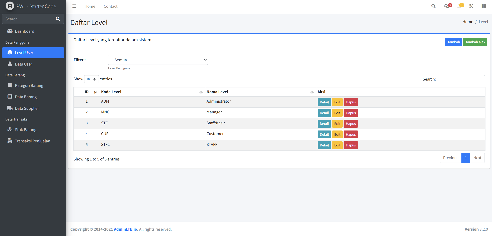

    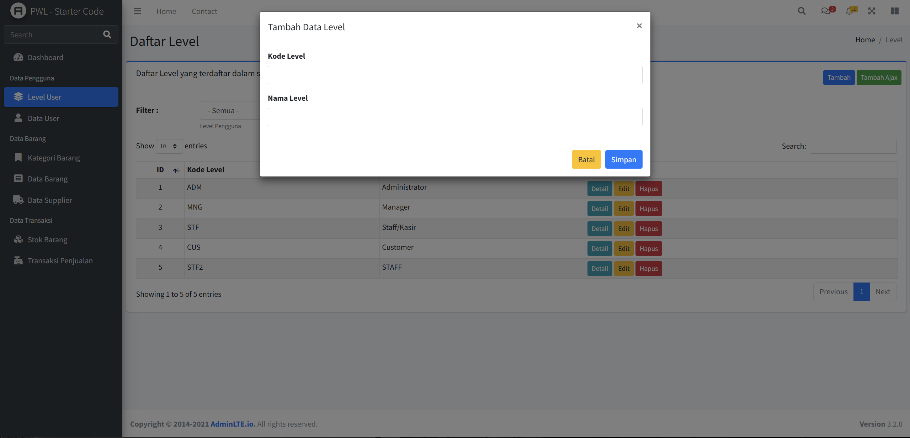

    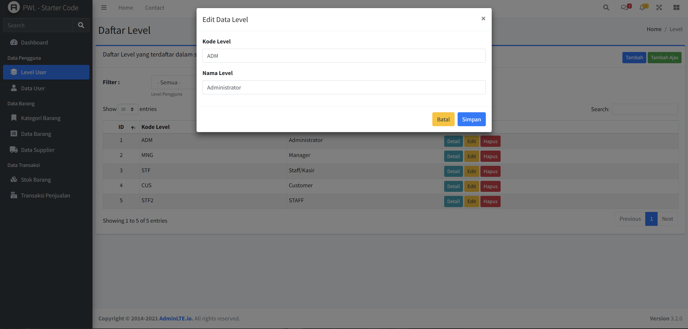

    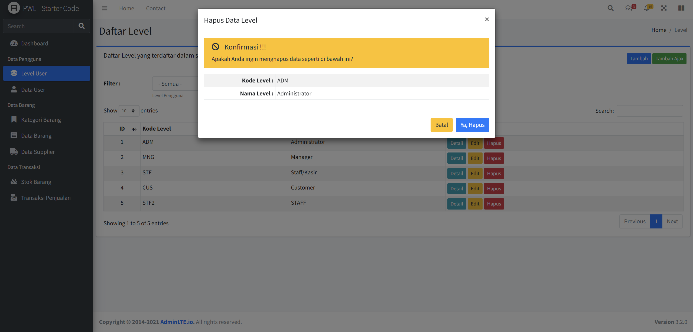

  - **Tabel m_kategori**

    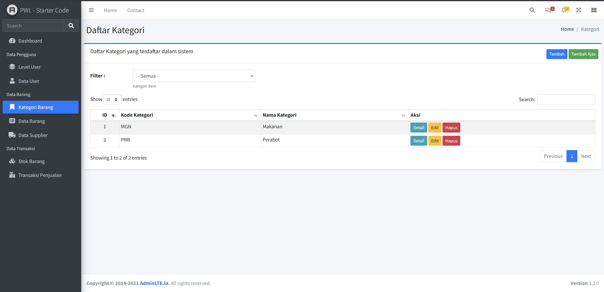

    

    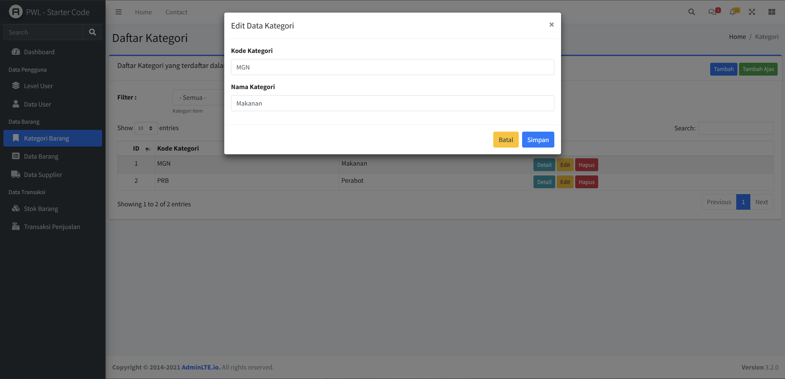

    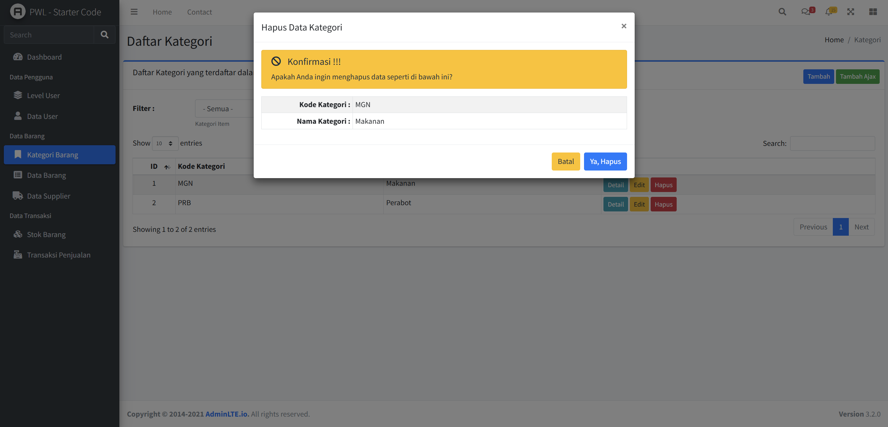

  - **Tabel m_supplier**

    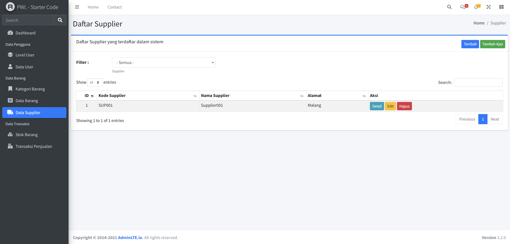

    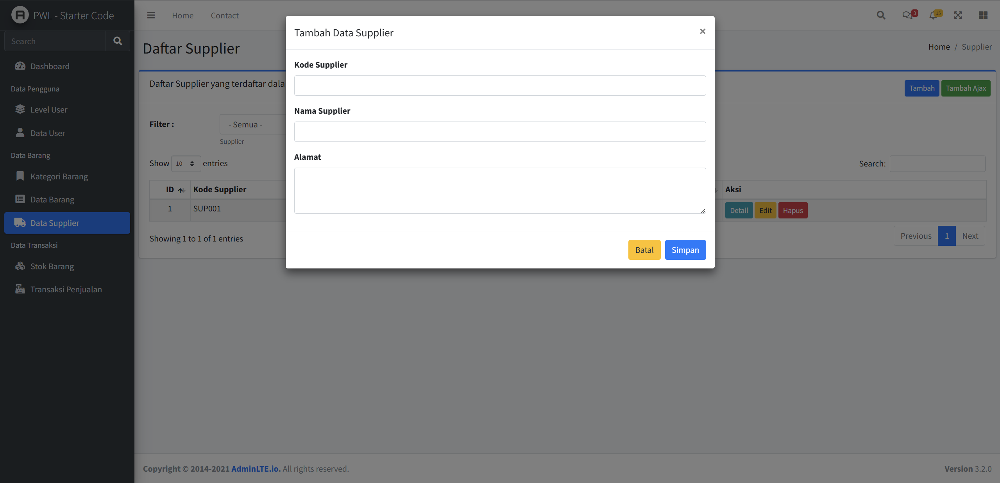

    

    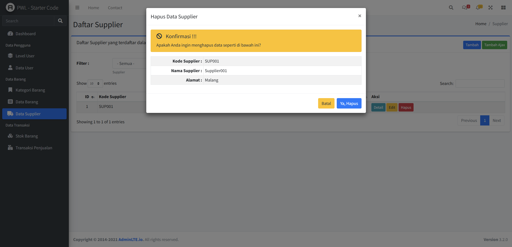

  - **Tabel m_barang**

    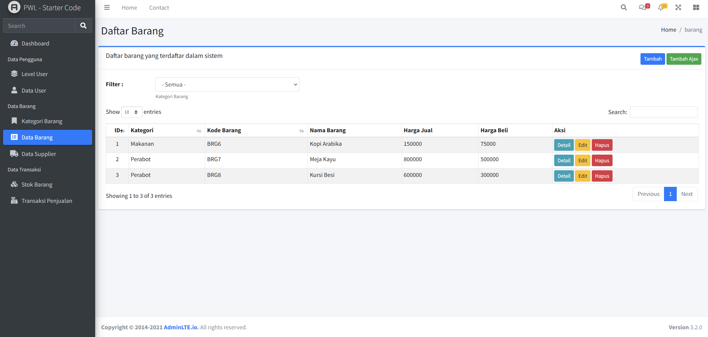

    

    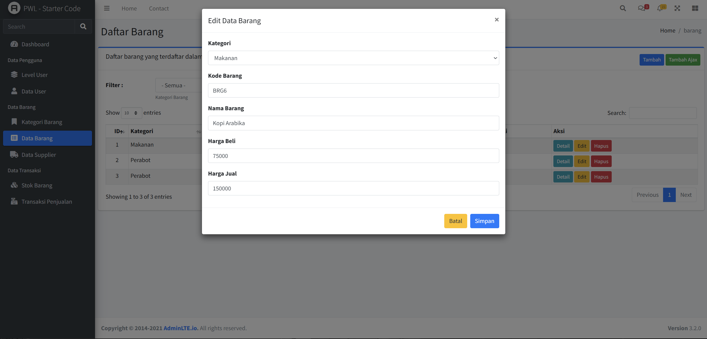

    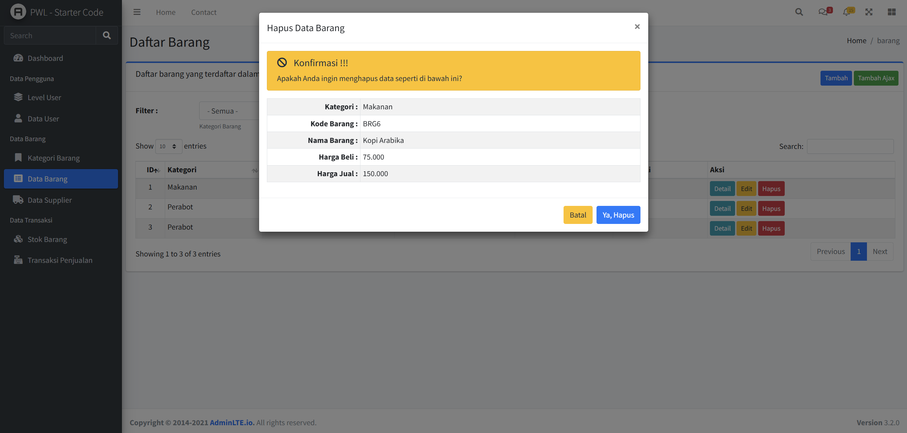

- Commit dan push hasil pekerjaan ke repository GitHub.