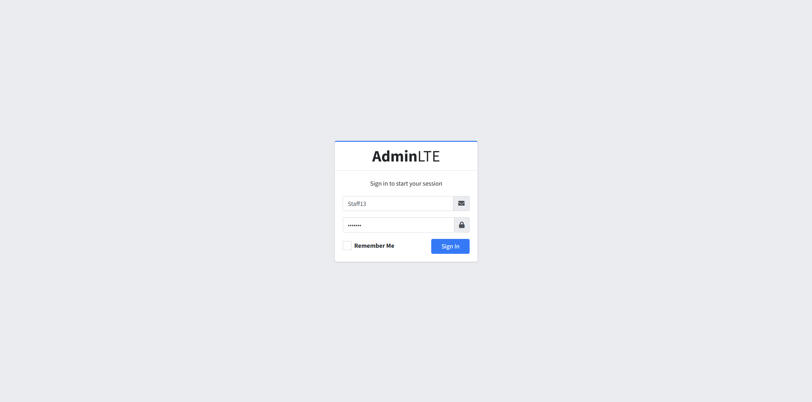
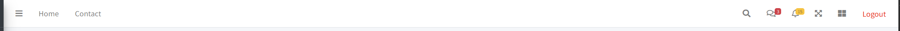
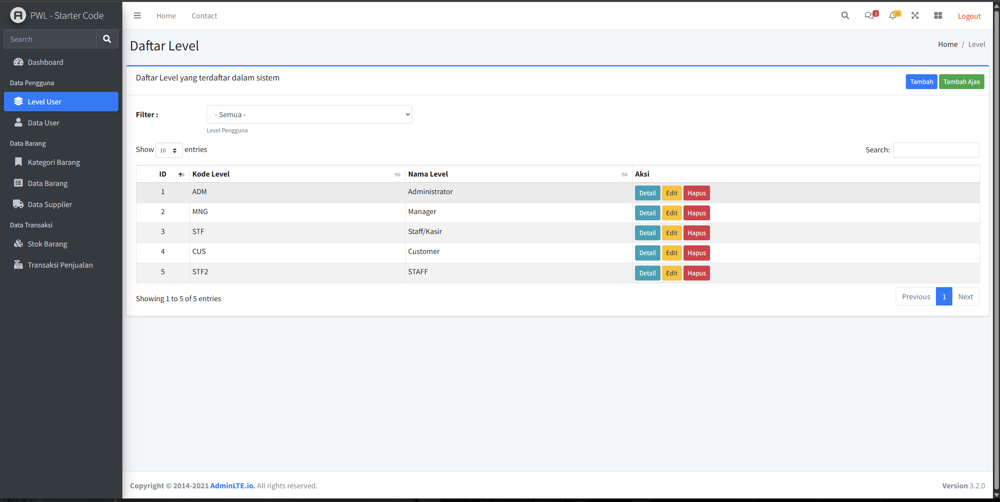
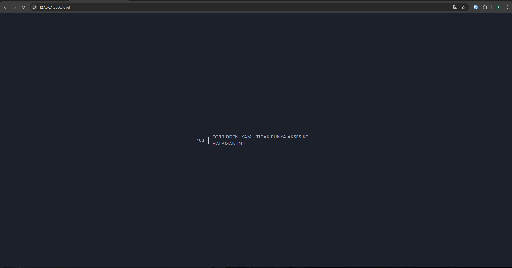
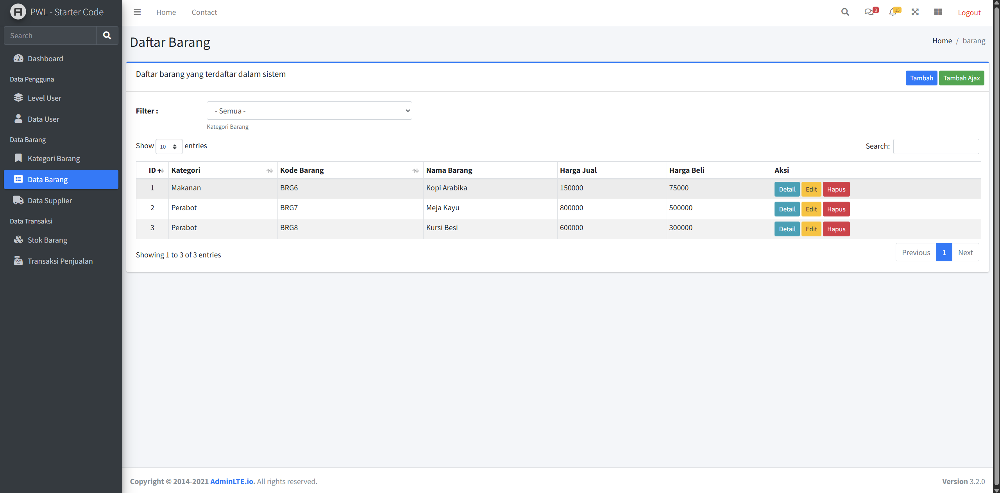
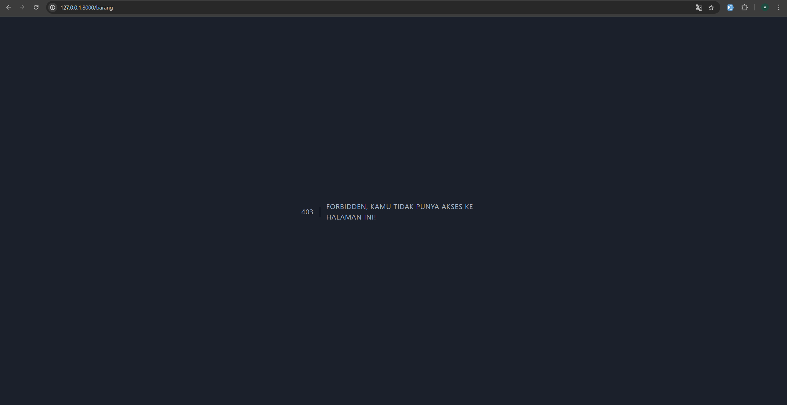

# Laporan Praktikum Jobsheet 07

## Identitas

- **Mata Kuliah**: Pemrograman Web Lanjut  
- **Program Studi**: Teknik Informatika  
- **Semester**: 4  
- **Praktikum**: Jobsheet 07 – Authentication dan Authorization di Laravel
- **Nama**: Alvanza Saputra Yudha  
- **NIM**: 2341720182  
- **Kelas**: TI-2A  

---

## Praktikum 1 - Implementasi Authentication

### Langkah-langkah:
1. **Memodifikasi `config/auth.php`**
2. **Memodifikasi `UserModel.php`**
3. **Membuat `AuthController.php`**
4. **Membuat `view login.blade.php`**
5. **Memodifikasi `web.php`**
6. **Hasil**

    

### Tugas 1:
1. Silahkan implementasikan proses login pada project kalian masing-masing
2. Silahkan implementasi proses logout pada halaman web yang kalian buat
    - Membuat button login di header 

    

3. Amati dan jelaskan tiap tahapan yang kalian kerjakan, dan jabarkan dalam laporan
4. Submit kode untuk impementasi Authentication pada repository github kalian.

## Praktikum 2 - Implementasi Authorizaton di Laravel dengan Middleware

### Langkah-langkah:
1. **Memodifikasi `UserModel.php`**
2. **Membuat `AuthorizeUser.php`**
3. **Mendaftarkan middleware di `Kernel.php`**
4. **Memodifikasi `web.php`**
5. **Hasil**
    - Saat login menggunakan akun dengan level Admin

    

    - Saat login menggunakan akun dengan level Manager

    

### Tugas 2:
1. Apa yang kalian pahami pada praktikum 2 ini?
    - Yang saya pahami dari praktikum 2 ini adalah kita bisa memisahkan fitur-fitur sesuai dengan role dari usernya dengan menggunakan middleware ini. Jadi hanya dengan mendaftarkan routenya sesuai dengan rolenya kita sudah bisa memisahkan fitur-fiturnya
2. Amati dan jelaskan tiap tahapan yang kalian kerjakan, dan jabarkan dalam laporan
3. Submit kode untuk impementasi Authorization pada repository github kalian.

## Praktikum 3 - Implementasi Multi-Level Authorizaton di Laravel dengan Middleware

### Langkah-langkah:
1. **Memodifikasi `UserModel.php`**
2. **Membuat `AuthorizeUser.php`**
3. **Memodifikasi `web.php`**
4. **Hasil**
    - Saat login menggunakan akun dengan level Admin

    

    - Saat login menggunakan akun dengan level Manager

    

    - Saat login menggunakan akun dengan level Customr

    

### Tugas 3:
1. Silahkan implementasikan multi-level authorization pada project kalian masing-masing
2. Amati dan jelaskan tiap tahapan yang kalian kerjakan, dan jabarkan dalam laporan
3. Implementasikan multi-level authorization untuk semua Level/Jenis User dan Menu-menu yang sesuai dengan Level/Jenis User
    - Role Admin : Semua Fitur
    - Role Manager : Fitur Kategori, Barang, dan Supplier
4. Submit kode untuk impementasi Authorization pada repository github kalian.
