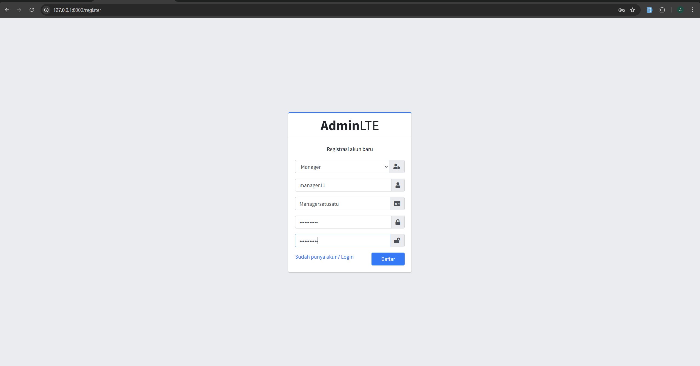

# Laporan Praktikum Jobsheet 07

## Identitas

- **Mata Kuliah**: Pemrograman Web Lanjut  
- **Program Studi**: Teknik Informatika  
- **Semester**: 4  
- **Praktikum**: Jobsheet 07 – Authentication dan Authorization di Laravel
- **Nama**: Alvanza Saputra Yudha  
- **NIM**: 2341720182  
- **Kelas**: TI-2A  

---

## Praktikum 1 - Implementasi Authentication

### Langkah-langkah:
1. **Memodifikasi `config/auth.php`**
2. **Memodifikasi `UserModel.php`**
3. **Membuat `AuthController.php`**
4. **Membuat `view login.blade.php`**
5. **Memodifikasi `web.php`**
6. **Hasil**

    

### Tugas 1:
1. Silahkan implementasikan proses login pada project kalian masing-masing
2. Silahkan implementasi proses logout pada halaman web yang kalian buat
    - Membuat button login di header 

    

3. Amati dan jelaskan tiap tahapan yang kalian kerjakan, dan jabarkan dalam laporan
4. Submit kode untuk impementasi Authentication pada repository github kalian.

## Praktikum 2 - Implementasi Authorizaton di Laravel dengan Middleware

### Langkah-langkah:
1. **Memodifikasi `UserModel.php`**
2. **Membuat `AuthorizeUser.php`**
3. **Mendaftarkan middleware di `Kernel.php`**
4. **Memodifikasi `web.php`**
5. **Hasil**
    - Saat login menggunakan akun dengan level Admin

    

    - Saat login menggunakan akun dengan level Manager

    

### Tugas 2:
1. Apa yang kalian pahami pada praktikum 2 ini?
    - Yang saya pahami dari praktikum 2 ini adalah kita bisa memisahkan fitur-fitur sesuai dengan role dari usernya dengan menggunakan middleware ini. Jadi hanya dengan mendaftarkan routenya sesuai dengan rolenya kita sudah bisa memisahkan fitur-fiturnya
2. Amati dan jelaskan tiap tahapan yang kalian kerjakan, dan jabarkan dalam laporan
3. Submit kode untuk impementasi Authorization pada repository github kalian.

## Praktikum 3 - Implementasi Multi-Level Authorizaton di Laravel dengan Middleware

### Langkah-langkah:
1. **Memodifikasi `UserModel.php`**
2. **Membuat `AuthorizeUser.php`**
3. **Memodifikasi `web.php`**
4. **Hasil**
    - Saat login menggunakan akun dengan level Admin

    

    - Saat login menggunakan akun dengan level Manager

    

    - Saat login menggunakan akun dengan level Customr

    

### Tugas 3:
1. Silahkan implementasikan multi-level authorization pada project kalian masing-masing
2. Amati dan jelaskan tiap tahapan yang kalian kerjakan, dan jabarkan dalam laporan
3. Implementasikan multi-level authorization untuk semua Level/Jenis User dan Menu-menu yang sesuai dengan Level/Jenis User
    - Role Admin : Semua Fitur
    - Role Manager : Fitur Kategori, Barang, dan Supplier
4. Submit kode untuk impementasi Authorization pada repository github kalian.

### Tugas 4: Implementasi Form Registrasi
1. Silahkan implementasikan form untuk registrasi user.
2. Screenshot hasil yang kalian kerjakan

    - Menambahkan `RegisterController.php`
    ```php
    namespace App\Http\Controllers;

    use Illuminate\Http\Request;
    use App\Models\UserModel;
    use App\Models\LevelModel;
    use Illuminate\Support\Facades\Hash;

    class RegisterController extends Controller
    {
        public function create()
        {
            $levels = LevelModel::all();
            return view('auth.register', compact('levels'));
        }

        public function store(Request $request)
        {
            try {
                $request->validate([
                    'username' => 'required|unique:m_user,username',
                    'nama' => 'required|string|max:100',
                    'password' => 'required|string|min:6|confirmed',
                    'level_id' => 'required|exists:m_level,level_id'
                ]);
        
                UserModel::create([
                    'username' => $request->username,
                    'nama' => $request->nama,
                    'password' => Hash::make($request->password),
                    'level_id' => $request->level_id
                ]);
        
                return redirect()->route('login')->with('success', 'Registrasi berhasil! Silahkan login.');
            } catch (\Exception $e) {
                return redirect()->back()->withInput()->with('error', 'Registrasi gagal: ' . $e->getMessage());
            }
        }
    }
    ```

    - Menambahkan form `register.blade.php`
    ```php
    <form action="{{ route('register.store') }}" method="POST" id="form-register">
        @csrf
        <div class="input-group mb-3">
          <select name="level_id" class="form-control">
            <option value="">Pilih Level</option>
            @foreach($levels as $level)
              <option value="{{ $level->level_id }}">{{ $level->level_nama }}</option>
            @endforeach
          </select>
          <div class="input-group-append">
            <div class="input-group-text">
              <span class="fas fa-user-tag"></span>
            </div>
          </div>
        </div>

        <div class="input-group mb-3">
          <input type="text" name="username" class="form-control" placeholder="Username" required>
          <div class="input-group-append">
            <div class="input-group-text">
              <span class="fas fa-user"></span>
            </div>
          </div>
        </div>

        <div class="input-group mb-3">
          <input type="text" name="nama" class="form-control" placeholder="Nama Lengkap" required>
          <div class="input-group-append">
            <div class="input-group-text">
              <span class="fas fa-id-card"></span>
            </div>
          </div>
        </div>

        <div class="input-group mb-3">
          <input type="password" name="password" class="form-control" placeholder="Password" required>
          <div class="input-group-append">
            <div class="input-group-text">
              <span class="fas fa-lock"></span>
            </div>
          </div>
        </div>

        <div class="input-group mb-3">
          <input type="password" name="password_confirmation" class="form-control" placeholder="Konfirmasi Password" required>
          <div class="input-group-append">
            <div class="input-group-text">
              <span class="fas fa-lock-open"></span>
            </div>
          </div>
        </div>

        <div class="row">
          <div class="col-8">
            <a href="{{ route('login') }}">Sudah punya akun? Login</a>
          </div>
          <div class="col-4">
            <button type="submit" class="btn btn-primary btn-block">Daftar</button>
          </div>
        </div>
      </form>
    ```

    - Hasil

    

3. Commit dan push hasil tugas kalian ke masing-masing repo github kalian