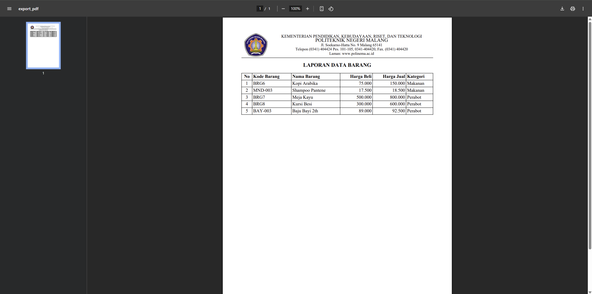

# Laporan Praktikum Jobsheet 08

## Identitas

- **Mata Kuliah**: Pemrograman Web Lanjut  
- **Program Studi**: Teknik Informatika  
- **Semester**: 4  
- **Praktikum**: Jobsheet 07 – File Import dan Export ke PDF dan Excel pada Laravel
- **Nama**: Alvanza Saputra Yudha  
- **NIM**: 2341720182  
- **Kelas**: TI-2A  

---

## Praktikum 1 - Implementasi Upload File untuk import data

### Langkah-langkah:
1. **Membuat template barang di excel**
2. **Memodifikasi `barang/index.blade.php`**
3. **Membuat file `barang/import.blade.php`**
4. **Memodifikasi `web.php`**
5. **Menginstall library dengan command**
    ```
    composer require phpoffice/phpspreadsheet
    ```
6. **Memodifikasi `BarangController.php`**
7. **Hasil**
    - Tombol import barang

        

    - Modal import barang

        

    - Berhasil import data barang
    
        

### Tugas 1:
1. Silahkan implementasikan praktikum 1 pada project kalian masing-masing untuk semua menu
2. Amati dan jelaskan tiap tahapan yang kalian kerjakan, dan jabarkan dalam laporan
3. Submit kode untuk impementasi prakktikum 1 pada repository github kalian.

## Praktikum 2 - Export Data ke Excel

### Langkah-langkah:
1. **Memodifikasi `barang/index.blade.php`**
2. **Memodifikasi `web.php`**
3. **Menambahkan fungsi export_excel() di `BarangController.php`**
4. **Hasil**
    - Tombol Export Barang

        

    - Hasil Download Data Barang

        

    - Hasil Data Barang yang telah di export

        

### Tugas 2:
1. Silahkan implementasikan praktikum 2 pada project kalian masing-masing untuk semuamenu
2. Amati dan jelaskan tiap tahapan yang kalian kerjakan, dan jabarkan dalam laporan
3. Submit kode untuk impementasi prakktikum 2 pada repository github kalian.

## Praktikum 3 - Implementasi Export PDF pada Laravel

### Langkah-langkah:
1. **Menginstall library dengan command**
    ```
    composer require barryvdh/laravel-dompdf
    ```
2. **Memodifikasi `barang/index.blade.php`**
3. **Memodifikasi `web.php`**
4. **Menambahkan fungsi export_pdf() di `BarangController.php`**
5. **Menambahkan view di `barang/export_pdf.blade.php`**
4. **Hasil**
    - Tombol export pdf

        
        
    - Hasil generate pdf

        