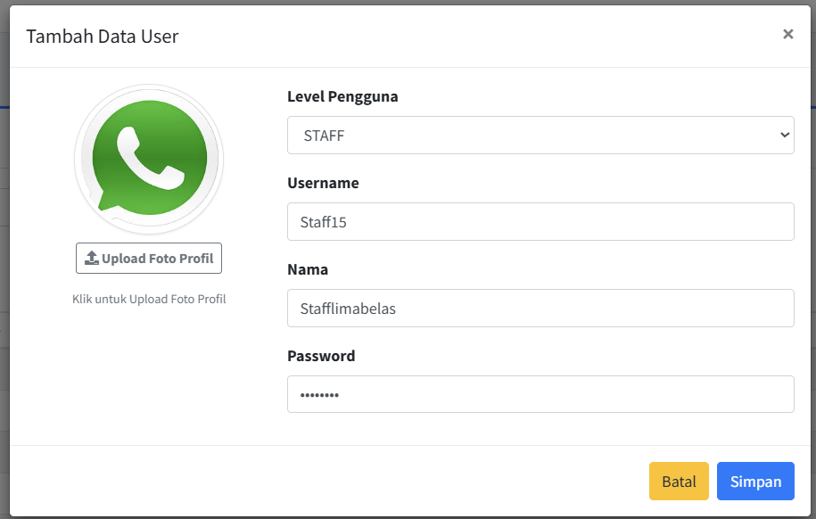
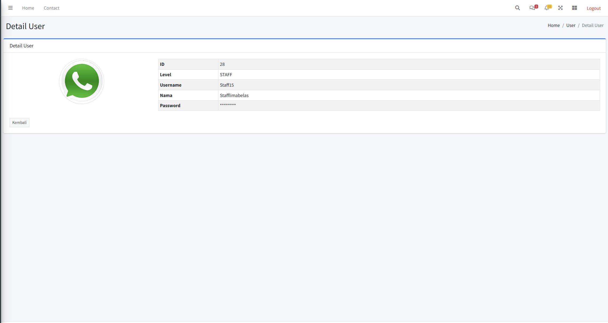
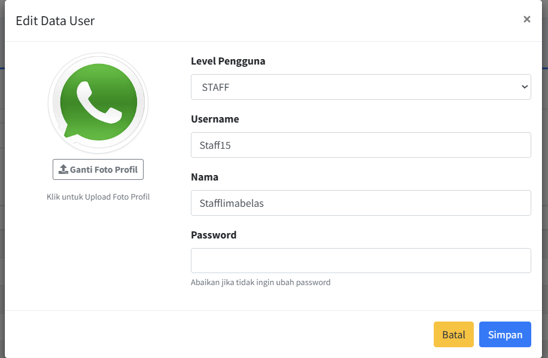
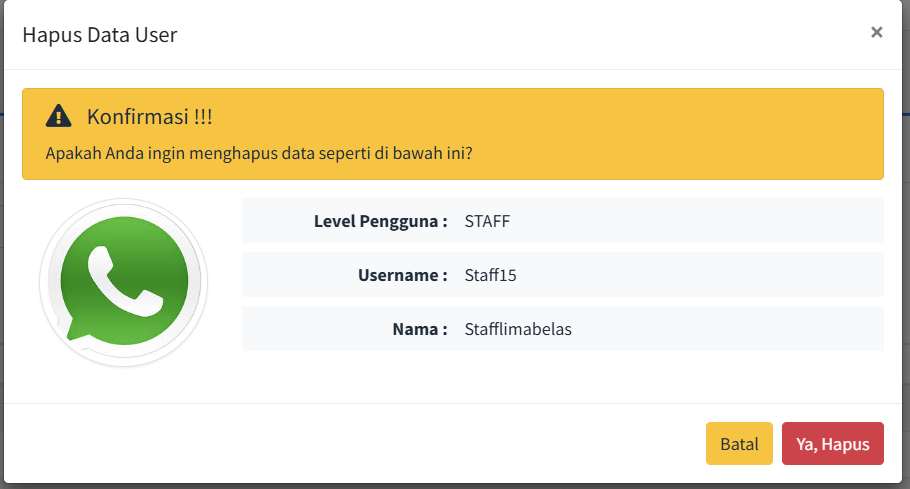

# Laporan Praktikum Jobsheet 08

## Identitas

- **Mata Kuliah**: Pemrograman Web Lanjut  
- **Program Studi**: Teknik Informatika  
- **Semester**: 4  
- **Praktikum**: Jobsheet 07 – File Import dan Export ke PDF dan Excel pada Laravel
- **Nama**: Alvanza Saputra Yudha  
- **NIM**: 2341720182  
- **Kelas**: TI-2A  

---

## Praktikum 1 - Implementasi Upload File untuk import data

### Langkah-langkah:
1. **Membuat template barang di excel**
2. **Memodifikasi `barang/index.blade.php`**
3. **Membuat file `barang/import.blade.php`**
4. **Memodifikasi `web.php`**
5. **Menginstall library dengan command**
    ```
    composer require phpoffice/phpspreadsheet
    ```
6. **Memodifikasi `BarangController.php`**
7. **Hasil**
    - Tombol import barang

        

    - Modal import barang

        

    - Berhasil import data barang
    
        

### Tugas 1:
1. Silahkan implementasikan praktikum 1 pada project kalian masing-masing untuk semua menu
2. Amati dan jelaskan tiap tahapan yang kalian kerjakan, dan jabarkan dalam laporan
3. Submit kode untuk impementasi prakktikum 1 pada repository github kalian.

## Praktikum 2 - Export Data ke Excel

### Langkah-langkah:
1. **Memodifikasi `barang/index.blade.php`**
2. **Memodifikasi `web.php`**
3. **Menambahkan fungsi export_excel() di `BarangController.php`**
4. **Hasil**
    - Tombol Export Barang

        

    - Hasil Download Data Barang

        

    - Hasil Data Barang yang telah di export

        

### Tugas 2:
1. Silahkan implementasikan praktikum 2 pada project kalian masing-masing untuk semuamenu
2. Amati dan jelaskan tiap tahapan yang kalian kerjakan, dan jabarkan dalam laporan
3. Submit kode untuk impementasi prakktikum 2 pada repository github kalian.

## Praktikum 3 - Implementasi Export PDF pada Laravel

### Langkah-langkah:
1. **Menginstall library dengan command**
    ```
    composer require barryvdh/laravel-dompdf
    ```
2. **Memodifikasi `barang/index.blade.php`**
3. **Memodifikasi `web.php`**
4. **Menambahkan fungsi export_pdf() di `BarangController.php`**
5. **Menambahkan view di `barang/export_pdf.blade.php`**
4. **Hasil**
    - Tombol export pdf

        

    - Hasil generate pdf

        

### Tugas 3:
1. Silahkan implementasikan export pdf pada project kalian masing-masing untuk semua menu
2. Amati dan jelaskan tiap tahapan yang kalian kerjakan, dan jabarkan dalam laporan
3. Submit kode untuk impementasi export pdf pada repository github kalian.

### Tugas 4:
1. Silahkan implementasikan fitur upload file untuk mengubah foto profile di project web kalian
    - Tambah Data dengan foto profile

        

    - Detail Data dengan foto profile

        

    - Edit Data dengan foto profile

        

    - Hapus Data dengan foto profile

        

2. Jelaskan tiap tahapan yang kalian kerjakan, dan jabarkan dalam laporan
    - Membuat migrasi untuk menambahkan kolom `path_foto` untuk menyimpan path foto di database
    ```php
    public function up(): void
    {
        Schema::table('m_user', function (Blueprint $table) {
            $table->string('path_foto')->nullable();
        });
    }

    /**
     * Reverse the migrations.
     */
    public function down(): void
    {
        Schema::table('m_user', function (Blueprint $table) {
            $table->dropColumn(['path_foto']);
        });
    }
    ```

    - Menambahkan path_foto di variable fillable pada `UserModel.php`
    ```php
    protected $fillable = [
        'level_id',
        'username',
        'nama',
        'password',
        'path_foto'
    ];
    ```

    - Membuat view untuk upload, edit, detail, dan hapus tampilan foto profil

        - Upload 
        ```php
        <div class="profile-photo-container mb-3">
            <div id="preview-container">
                
            </div>
            <div class="mt-2">
                <label for="foto_profil" class="btn btn-sm btn-outline-secondary">
                    <i class="fa fa-upload"></i> Upload Foto Profil
                </label>
                <input type="file" class="custom-file-input d-none" id="foto_profil" name="foto_profil" accept="image/*">
            </div>
            <small id="error-foto_profil" class="error-text form-text text-danger"></small>
            <div class="text-center mt-1">
                <small class="text-muted">Klik untuk Upload Foto Profil</small>
            </div>
        </div>
        ```

        - Detail
        ```php
        <div class="profile-image-container mb-3">
            @if($user->path_foto)
                path_foto) }}" alt="Foto Profil" class="img-thumbnail rounded-circle" style="width: 150px; height: 150px; object-fit: cover;">
            @else
                
            @endif
        </div>
        ```
        - Edit
        ```php
        <div class="profile-photo-container mb-3">
            <div id="preview-container">
                @if($user->path_foto)
                    path_foto) }}" alt="Foto Profil" class="img-thumbnail rounded-circle" style="width: 150px; height: 150px; object-fit: cover;">
                @else
                    
                @endif
            </div>
            <div class="mt-2">
                <label for="foto_profil" class="btn btn-sm btn-outline-secondary">
                    <i class="fa fa-upload"></i> Ganti Foto Profil
                </label>
                <input type="file" class="custom-file-input d-none" id="foto_profil" name="foto_profil" accept="image/*">
            </div>
            <small id="error-foto_profil" class="error-text form-text text-danger"></small>
            <div class="text-center mt-1">
                <small class="text-muted">Klik untuk Upload Foto Profil</small>
            </div>
        </div>
        ```
        - Delete
        ```php
        <div class="col-md-3 text-center mb-3">
            @if($user->path_foto)
                path_foto) }}" alt="Foto Profil" class="img-thumbnail rounded-circle" style="width: 150px; height: 150px; object-fit: cover;">
            @else
                
            @endif
        </div>
        ```

    - Memodifikasi `UserController.php`
    ```php
    public function store_ajax(Request $request){
        if($request->ajax() || $request->wantsJson()){
            $rules = [
                'level_id' => 'required|integer',
                'username' => 'required|string|min:3|unique:m_user,username',
                'password' => 'required|min:5',
                'nama' => 'required|string|max:100',
                'foto_profil' => 'nullable|image|mimes:jpeg,png,jpg,gif|max:2048'
            ];

            $validator = Validator::make($request->all(), $rules);

            if($validator->fails()){
                return response()->json([
                    'status' => false,
                    'messages' => "Validasi Gagal",
                    'msgField' => $validator->errors(),
                ]);
            }

            $data = [
                'level_id' => $request->level_id,
                'username' => $request->username,
                'nama' => $request->nama,
                'password' => bcrypt($request->password)
            ];

            // Handle file upload
            if ($request->hasFile('foto_profil')) {
                $file = $request->file('foto_profil');
                $fileName = time() . '_' . $file->getClientOriginalName();
                $file->storeAs('public/foto_profil', $fileName);
                $data['path_foto'] = 'foto_profil/' . $fileName;
            }

            UserModel::create($data);

            return response()->json([
                'status' => true,
                'messages' => "Data Berhasil Disimpan",
            ]);
        }
    }

    public function delete_ajax(request $request, $id) {
        if($request->ajax() || $request->wantsJson()){
            $user = UserModel::find($id);
            if ($user) {
                // Delete file if exists
                if ($user->path_foto) {
                    Storage::delete('public/' . $user->path_foto);
                }
                
                $user->delete();
                return response()->json([
                    'status' => true,
                    'message' => 'Data berhasil dihapus'
                ]);
            } else {
                return response()->json([
                    'status' => false,
                    'message' => 'Data tidak ditemukan'
                ]);
            }
        }

        return redirect('/');
    }
    ```

3. Submit kode untuk impementasi export pdf pada repository github kalian.


