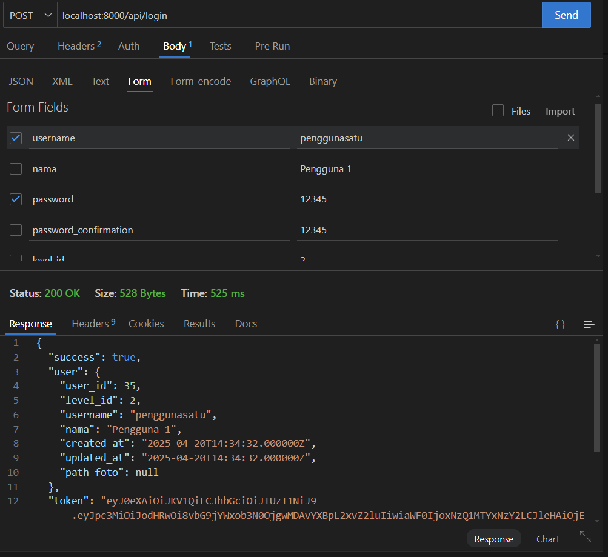
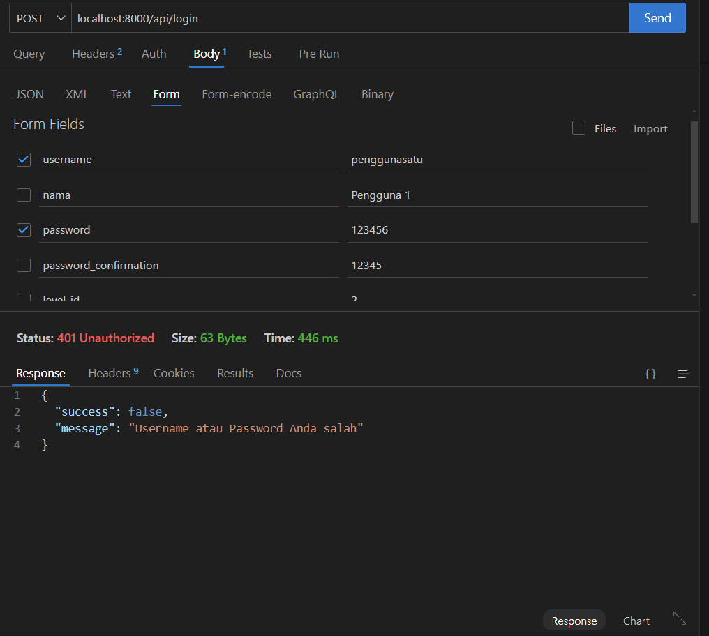
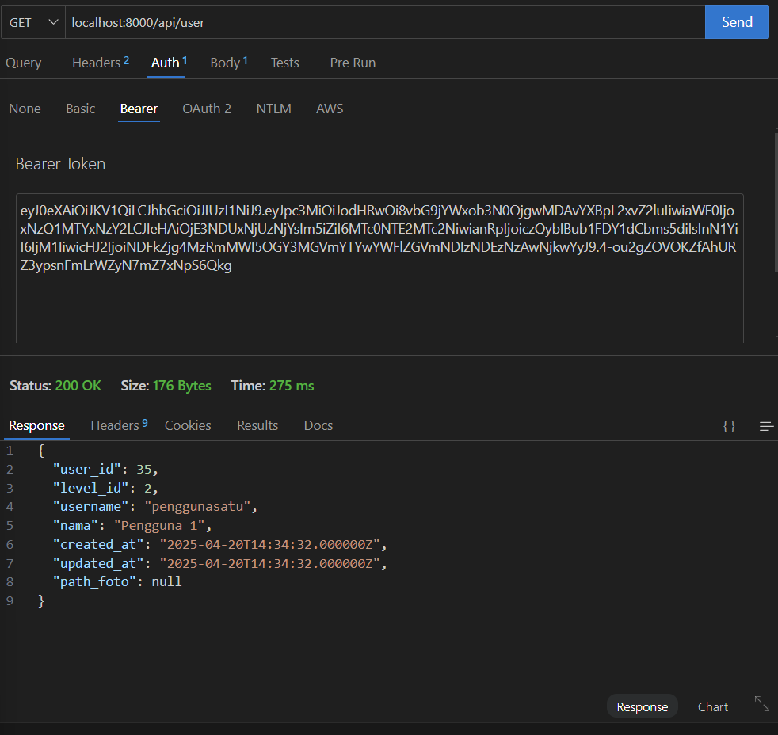

# Laporan Praktikum Jobsheet 10

## Identitas

- **Mata Kuliah**: Pemrograman Web Lanjut  
- **Program Studi**: Teknik Informatika  
- **Semester**: 4  
- **Praktikum**: Jobsheet 10 – RESTFUL API
- **Nama**: Alvanza Saputra Yudha  
- **NIM**: 2341720182  
- **Kelas**: TI-2A  

---

## Praktikum 1 - Membuat RESTful API Register

### Langkah-langkah:
1. **Mendownload aplikasi postman(tetapi disini saya menggunakan extension Thunder Client di VSCode sebagai gantinya)**
2. **Menginstall JWT**
    ```
    composer require tymon/jwt-auth:2.1.1
    ```
3. **Publish konfigurasi**
    ```
    php artisan jwt:secret
    ```
4. **Membuat secret key**
    ```
    php artisan vendor:publish --provider="Tymon\JWTAuth\Providers\LaravelServiceProvider"
    ```
5. **Memodifikasi `config/auth.php`**
6. **Menambah kode di `UserModel.php`**
7. **Membuat controller di `controller/Api/RegisterController`**
8. **Hasil**
    - Uji coba tanpa data

        

    - Uji coba dengan data

        


## Praktikum 2 - Membuat RESTful API Login

### Langkah-langkah:
1. **Membuat controller di `controller/Api/LoginController`**
1. **Menambah route baru di `api.php`**
7. **Hasil**
    - Uji coba tanpa data

        

    - Uji coba dengan data

        

    - Uji coba dengan data yang salah

        

    - Uji coba dengan menggunakan method get di route /user dengan menggunakan token di uji coba sebelumnya

        
